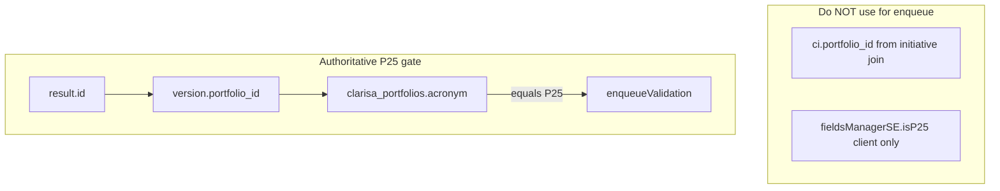

# AI-Driven Evidence Quality Assessment Module (revised)

**Revision basis:** Cross-review by Yecksin/Claudio against live code (Jul 2026). Prior plan ~24/24 assertions verified; corrections below address P25 detection, frontend mount point, backend enqueue placement, schema pattern, and naming.

---

## Research Summary (unchanged, verified)

### Current evidence data model

| Table | Entity | Role |
|-------|--------|------|
| `evidence` | [`evidence.entity.ts`](onecgiar-pr-server/src/api/results/evidences/entities/evidence.entity.ts) | `link`, typology flags, `is_sharepoint`, `result_id` |
| `evidence_sharepoint` | [`evidence-sharepoint.entity.ts`](onecgiar-pr-server/src/api/results/evidences/entities/evidence-sharepoint.entity.ts) | `document_id`, `is_public_file`, … |

- No AI validation on evidence today.
- [`api/ai/`](onecgiar-pr-server/src/api/ai/) persists text-field review only (`title`, `description`, `short_title`); **no LLM invocation**, **no `evidence_id`**.
- Bedrock: **absent** from repo.
- RMQ export pattern exists but uses **in-memory** job map — evidence quality needs **DB-durable** status via log table.

### Scope (confirmed with product)

| Layer | Rule |
|-------|------|
| Backend enqueue | All evidence rows saved for **P25 results** (all indicator typologies on the row) |
| Frontend UI | **P25 only**, standalone **Evidence** section — [`rd-evidences`](onecgiar-pr-client/src/app/pages/results/pages/result-detail/pages/rd-evidences/) |
| Policy | **Warn only** — never block save, green-check, or submit |

---

## Critical fix: P25 portfolio detection

### Problem

The original plan assumed a single clean `portfolio` field reusable from `getResultById`. In practice there are **four divergent paths** in the codebase:

| Path | Where | What it uses |
|------|-------|--------------|
| 1 | Client `FieldsManagerService.isP25()` | `currentResultSignal()?.portfolio` string |
| 2 | `result.repository.getResultById()` | Raw SQL subquery: `version.portfolio_id` → `cp.acronym AS portfolio` |
| 3 | List/filter queries | `ci.portfolio_id` (initiative portfolio) — **can differ** from phase portfolio |
| 4 | [`results-validation-module.repository.ts`](onecgiar-pr-server/src/api/results/results-validation-module/results-validation-module.repository.ts) | `result.obj_version?.obj_portfolio?.acronym === 'P25'` via TypeORM relations |

SQL green-check [`validation_evidences_P25`](onecgiar-pr-server/src/migrations/1762528725798-createValidtionP25.ts) uses the **authoritative** join:

```sql
FROM result r
INNER JOIN version v ON v.id = r.version_id
INNER JOIN clarisa_portfolios cp ON cp.id = v.portfolio_id
-- cp.acronym drives validation_*_P25 function suffix
```

Constant already exists: [`P25_PORTFOLIO_ACRONYM = 'P25'`](onecgiar-pr-server/src/shared/constants/portfolio.constant.ts).

### Required implementation

Add a **single shared server utility** (e.g. `PortfolioContextService.isResultP25(resultId)` or method on `ResultRepository`):

```typescript
// Canonical — match validation module + SQL functions
const result = await resultRepo.findOne({
  where: { id: resultId, is_active: true },
  relations: { obj_version: { obj_portfolio: true } },
});
return result?.obj_version?.obj_portfolio?.acronym === P25_PORTFOLIO_ACRONYM;
```

**Do not** gate enqueue on `ci.portfolio_id` (initiative) or on client `portfolio` alone. Client `fieldsManagerSE.isP25()` is **display-only**; server utility is authoritative.



---

## Schema Delta (revised — align with `result_field_ai_state`)

### Why change from cache columns on `evidence`

[`result_field_ai_state`](onecgiar-pr-server/src/api/ai/entities/result-field-ai-state.entity.ts) already models per-field AI lifecycle:

- One row per `(result_id, field_name)` with `status`, `last_ai_proposal_id`, timestamps
- Append-only history lives in `ai_review_proposal` / `ai_review_event`

**Mirror that pattern** for evidence instead of sprinkling cache columns on `evidence`.

### New table: `evidence_ai_validation_log` (append-only history)

Unchanged purpose — one row per async run:

| Column | Purpose |
|--------|---------|
| `id` | PK |
| `evidence_id` | FK → `evidence.id` |
| `evidence_sharepoint_id` | Nullable FK |
| `status` | `PENDING`, `EXTRACTING`, `ANALYZING`, `COMPLETED`, `FAILED`, `SKIPPED` |
| `extraction_source` | `PUBLIC_URL`, `CGSPACE_MQAP`, `SHAREPOINT_GRAPH`, `CLIENT_CONSENT`, `UNREADABLE` |
| `model_id`, `prompt_version` | Bedrock traceability |
| `quality_score` | 0–100 |
| `mismatch_labels` | JSON array |
| `findings_summary` | Short UI text (no raw document body) |
| `result_context_snapshot` | JSON at run time |
| `error_code`, `triggered_by`, `duration_ms`, `created_at` | Audit |

### New table: `evidence_ai_state` (current state — like `result_field_ai_state`)

| Column | Purpose |
|--------|---------|
| `id` | PK |
| `evidence_id` | FK, **unique** |
| `status` | `PENDING`, `ANALYZING`, `COMPLETED`, `FAILED`, `SKIPPED`, `CONSENT_REQUIRED` |
| `last_validation_log_id` | FK → latest `evidence_ai_validation_log` |
| `ai_consent_granted` | User consent for private/restricted parsing |
| `quality_score` | Denormalized cache for list UI (from last completed run) |
| `mismatch_labels` | Denormalized JSON cache for card rendering |
| `last_updated_by`, `created_at`, `updated_at` | Audit (match `result_field_ai_state` timestamps) |

**Remove** planned columns on `evidence` (`last_ai_quality_score`, etc.) — UI reads `evidence_ai_state` joined in GET evidences response.

---

## Document Extraction Strategy (revised naming + deps)

| Source | Implementation |
|--------|----------------|
| SharePoint files | Extend [`SharePointService`](onecgiar-pr-server/src/shared/services/share-point/share-point.service.ts): new `downloadFileContent(documentId)`. Permissions via existing **`addFileAccess`** (not `createLink` — method does not exist under that name). |
| CGSpace | Reuse [`MQAPService`](onecgiar-pr-server/src/api/m-qap/m-qap.service.ts) |
| Public URLs | New fetcher with SSRF controls |
| Text parsing | **`pdf-parse`** and lightweight HTML-to-text are **not in package.json today** — add as explicit new dependencies in Phase 2 |

Consent: if `is_public_file = 0` and `!evidence_ai_state.ai_consent_granted` → `SKIPPED` / `CONSENT_REQUIRED` without download.

---

## Backend Module Design (revised)

### Persist paths that must trigger enqueue

| Client surface | HTTP entry | Service method |
|----------------|------------|----------------|
| Evidence section (`rd-evidences`) | `POST /api/results/evidences/create/:resultId` | [`evidences.service.create()`](onecgiar-pr-server/src/api/results/evidences/evidences.service.ts) |
| Innovation Dev user-demand (P25) | `POST /v2/api/innovation-development/evidence_demand/create/:resultId` | [`evidences.service.createV2()`](onecgiar-pr-server/src/api/results/evidences/evidences.service.ts) via [`innovation_dev.controller.ts`](onecgiar-pr-server/src/api/results-framework-reporting/innovation_dev/innovation_dev.controller.ts) |

Both must call enqueue for P25 results even though **UI is only on `rd-evidences`**.

### Enqueue placement (critical)

`create()` and `createV2()` wrap logic in `try/catch` that **returns** `handlersError.returnErrorRes` instead of rethrowing. Enqueue must run:

1. **After** evidence rows are persisted (`_processMainEvidencesOnCreate` / `save` complete).
2. **Outside** the catch path — e.g. collect `savedEvidenceIds` inside try, then in a `finally` or post-try block call `enqueueForP25Result(resultId, ids, userId)` with its **own** try/catch so a queue failure never fails the save response.
3. Only when `isResultP25Portfolio(resultId)` is true.

```typescript
// Pattern — enqueue must not be swallowed by save try/catch
let evidenceIdsToAssess: number[] = [];
try {
  evidenceIdsToAssess = await this.persistEvidences(...);
  return { response, message, status: HttpStatus.OK };
} catch (error) {
  return this._handlersError.returnErrorRes({ error, debug: true });
} finally {
  if (evidenceIdsToAssess.length) {
    void this.evidenceQualityService.enqueueBatch(resultId, evidenceIdsToAssess, user.id)
      .catch(err => this.logger.warn('Evidence AI enqueue failed')); // generic log, no secrets
  }
}
```

### API contract

| Method | Path | Notes |
|--------|------|-------|
| `GET` | `/api/results/evidences/:evidenceId/ai-validation` | `@Param('evidenceId', ParseIntPipe)` |
| `GET` | `/api/results/evidences/ai-validation/by-result/:resultId` | `ParseIntPipe` on `resultId` |
| `PATCH` | `/api/results/evidences/:evidenceId/ai-consent` | `ParseIntPipe`; **gate**: evidence exists, user can edit result, result is P25, body `{ consent: true }` only |

Embed `ai_state` (optional) in existing `GET evidences/get/:resultId` for P25 to avoid N+1 polling.

### Module layout

`api/evidence-quality/` — consumer, extractor, Bedrock service, entities, DTOs. Wire into `evidences.module.ts` / `results.routes.ts`.

---

## Frontend Changes (revised — mount on list cards, not modal)

### P2-2935 layout reality

[`rd-evidences.component.html`](onecgiar-pr-client/src/app/pages/results/pages/result-detail/pages/rd-evidences/rd-evidences.component.html):

- **List**: flat `evidence_card` in `*ngFor` (lines 18–82) — **this is where per-evidence AI UI lives**.
- **Modal**: `p-dialog` + `app-evidence-item` (`embedded=true`) — create/edit only; **not** the list renderer.

[`evidence-item`](onecgiar-pr-client/src/app/pages/results/pages/result-detail/pages/rd-evidences/evidence-item/) stays unchanged for AI feedback unless consent checkbox is needed **during** private file selection in the modal (optional enhancement).

### Target files

| File | Change |
|------|--------|
| [`rd-evidences.component.html`](onecgiar-pr-client/src/app/pages/results/pages/result-detail/pages/rd-evidences/rd-evidences.component.html) | Inside `evidence_card` `*ngFor`, `@if (fieldsManagerSE.isP25())`: analyzing spinner, quality badge, mismatch warn block |
| [`rd-evidences.component.ts`](onecgiar-pr-client/src/app/pages/results/pages/result-detail/pages/rd-evidences/rd-evidences.component.ts) | Inject `FieldsManagerService`; map `ai_state` per evidence; poll after save |
| [`rd-evidences.component.scss`](onecgiar-pr-client/src/app/pages/results/pages/result-detail/pages/rd-evidences/rd-evidences.component.scss) | Styles for AI badge / warn strip on card |
| [`results-api.service.ts`](onecgiar-pr-client/src/app/shared/services/api/results-api.service.ts) | `GET_evidenceAiValidationByResult`, `PATCH_evidenceAiConsent` |

### UX components (correct primitives)

| Need | Use | Do not use |
|------|-----|------------|
| Section-level info banner | [`app-alert-status`](onecgiar-pr-client/src/app/custom-fields/alert-status/) | — |
| Per-card low-score warning | `app-alert-status` with `status="warning"` inline in card body | — |
| Consent for private parsing | **`p-dialog`** (same pattern as evidence create modal) or **`api.alertsFe.show`** confirm | `app-alert-status` as modal |
| Analyzing state | Inline in card (reuse upload skeleton pattern: `p-skeleton` + label "Analyzing quality…") | — |

### Copy / i18n

[`terminology.config.ts`](onecgiar-pr-client/src/app/internationalization/terminology.config.ts) is **portfolio vocabulary only** (P22 vs P25 label swaps), not general i18n. AI strings can be **plain English in templates** unless a term genuinely differs by portfolio — then add a `TermKey`.

### Warn-only policy (unchanged)

- Do **not** set `validateButtonDisabled`, `evidenceSectionComplete`, or save button disabled based on AI score.
- Yellow warn when `quality_score < threshold` (global parameter, default 60).

---

## AWS Bedrock Integration

Unchanged: new `@aws-sdk/client-bedrock-runtime`, `BedrockEvidenceAssessmentService`, env `AWS_BEDROCK_REGION` / `AWS_BEDROCK_MODEL_ID`, no raw text in DB/logs.

---

## OpenSpec / SDD Deliverables

1. `openspec/changes/evidence-ai-quality-assessment/` — proposal, design, tasks, spec
2. `docs/specs/results/evidence-quality/` — cite AC-6, detailed-design evidence section, system-design Evidence UX

---

## Testing Plan (updated)

| Layer | Focus |
|-------|-------|
| `isResultP25Portfolio` | Matches `obj_version.obj_portfolio.acronym`; rejects initiative-only portfolio |
| Enqueue | Fires from `create` and `createV2`; survives save try/catch; skipped for P22 |
| Consent API | ParseIntPipe, P25 gate, ownership |
| Client | AI blocks render in `*ngFor` cards when `isP25()`; absent from modal-only `evidence-item`; save never disabled |

---

## Phased Rollout

| Phase | Scope |
|-------|-------|
| **1** | Migration (`evidence_ai_validation_log` + `evidence_ai_state`), P25 util, enqueue + read APIs |
| **2** | Document extractor + new deps (`pdf-parse`, HTML-to-text); SharePoint download |
| **3** | Bedrock scoring + RMQ consumer |
| **4** | P25 card UI in `rd-evidences` *ngFor; consent `p-dialog` |
| **5** | Feature flag global param `evidence_ai_quality_enabled`, hardening |

---

## Out of Scope

- AI UI in `user-evidence` / Innovation Development section
- Blocking save / submit / green-check
- Bilateral / platform-report payload changes
- Replacing SQL `validation_evidences_P25` green-check
