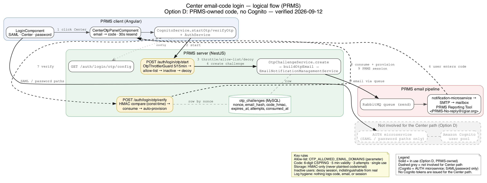
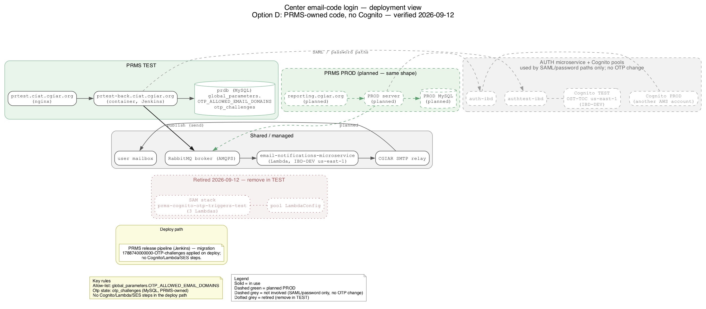

# Center email-code login — module reference

CGIAR **center staff who are not in the CGIAR Active Directory** sign in to PRMS with a 6-digit code e-mailed to them. As of **rev 4 (Option D, 2026-09-12)**, **PRMS generates the code, stores the challenge, sends the e-mail and verifies the answer itself — Cognito is not called anywhere on this path.** The session that comes back is a plain PRMS JWT, exactly like the password path.

> **Why this changed:** the PROD Cognito pool lives in an AWS account where the team has **console access to Cognito only** — no Lambda, CloudFormation or IAM — so the Cognito-trigger design proven on TEST (Option B) could never be deployed to PROD. Verified precondition that made D possible: PRMS's API validates only its **own** JWT (`JwtMiddleware`, `JWT_SKEY`); nothing downstream ever read the Cognito tokens the old provider-flow response carried. Removing Cognito from this path costs nothing functionally and needs **zero PROD Cognito change** (§8).
>
> **Product rule (unchanged):** a center user does not need a PRMS record before the first login. The first successful verify auto-provisions the PRMS user with the **guest** role — exactly as the CGIAR provider flow does.

---

## Quick path

1. An admin sets the PRMS global parameter `OTP_ALLOWED_EMAIL_DOMAINS` (empty = the path stays hidden).
2. The user opens `/login` → **"Continue with your Center account"** → types their center e-mail.
3. PRMS mints a 6-digit code, stores a challenge row, and e-mails the code through PRMS's own notification pipeline — from "PRMS Reporting Tool".
4. The user types the code; PRMS verifies it and returns the standard PRMS session (`token`, `user`) — no Cognito tokens.
5. Problem? → [Operations](#8-operations) below, or [`prod-rollout-runbook.md`](./prod-rollout-runbook.md) for PROD configuration.

---

## 1. The three login paths on `/login`

| Path | Button | Who | Mechanism |
|---|---|---|---|
| CGIAR | "Continue with your CGIAR account" | Staff in the CGIAR directory | Azure AD / SAML via `cognito.loginWithAzureAd()` |
| **Center** | "Continue with your Center account" | Center staff outside AD, domain in the allow-list | **This module** — a code PRMS itself generates, e-mails and verifies |
| External | "Continue as an external user" | Non-CGIAR accounts | E-mail + password (`loginWithCredentials()`) |

Only one path is open at a time (`LoginComponent` hides the Center panel while the external or password-change form is open). The Center block renders **only** when `GET auth/login/otp/config` returns a non-empty `domains` array. **None of the client contracts, the UI, or the copy changed with Option D** — the rewrite is entirely server-side.

## 2. End-to-end sequence

| # | Actor | Call / event |
|---|---|---|
| 1 | PRMS client | `GET auth/login/otp/config` → `{ domains: string[] }`; renders the Center block |
| 2 | PRMS client → PRMS server | `POST auth/login/otp/start { email }` |
| 3 | `OtpThrottlerGuard` | Counts the request first (5 / 15 min per normalised e-mail — even a request later rejected for its domain consumes a slot) |
| 4 | `AuthService.startOtp` | Normalise e-mail → allow-list check (else `400 OTP_DOMAIN_NOT_ALLOWED`) → user lookup: **inactive** PRMS user → neutral `200` with a signed **decoy** session, no row written, no e-mail sent |
| 5 | `OtpChallengeService.create(email)` | Mints a 22-char nonce and a `crypto.randomInt` 6-digit code, inserts one `otp_challenges` row (`email_hash`, `code_hmac`, `expires_at` = now + 5 min, `attempts: 0`), opportunistically purges rows expired over an hour |
| 6 | `AuthService` | Builds the response `session` with the **same signed encoder the decoy uses** (`buildDecoySession`), carrying the challenge's own nonce and expiry — a real and a decoy session are byte-indistinguishable |
| 7 | `sendOtpCodeEmail` → `EmailNotificationManagementService.sendEmail` | RabbitMQ (`RABBITMQ_URL` / `EMAIL_QUEUE` — PRMS's existing pipeline) → notification microservice → SMTP, from `EMAIL_SENDER` as "PRMS Reporting Tool"; a publish failure is swallowed into outcome `email_failed`, response stays a neutral `200` |
| 8 | PRMS server → client | `200 { sent: true, session, destination }` — byte-identical for known, unknown and inactive users |
| 9 | PRMS client → PRMS server | `POST auth/login/otp/verify { email, code, session }` |
| 10 | `AuthService.verifyOtp` | Parses + HMAC-checks the session; not a session PRMS issued, or expired → `401 OTP_NOT_AUTHORIZED`; otherwise looks up the `otp_challenges` row by the session's nonce — **its presence or absence is the only way a real session is told from a decoy** |
| 11 | `AuthService.verifyOtp` | No row → decoy path, answers exactly like a wrong code (rotated session included); row `consumed_at` set → `OTP_NOT_AUTHORIZED`; `attempts >= 3` → `OTP_ATTEMPTS_EXCEEDED`; `expires_at` passed → `OTP_CODE_EXPIRED`; `matchesCode` fails → `attempts++`, `401 OTP_CODE_MISMATCH` + rotated session |
| 12 | `AuthService.verifyOtp` | Match → `OtpChallengeService.consume()` (spends the code before anything else can fail) → `UserService.createOrUpdateUserFromAuthProvider({ email })` (creates the PRMS user with the guest role on first login) → `last_login` write |
| 13 | `AuthService.createSuccessfulLoginResponse(user, null)` | The standard PRMS session (`token`, `user`); `auth_tokens` is **absent from the response object**, not merely `null` — no consumer may depend on Cognito tokens for a center session |

**A wrong code is not an exception.** It answers `401 OTP_CODE_MISMATCH` with a freshly rotated `session` (same nonce, fresh tails) that the client must store before retrying — true for a real challenge and for a decoy alike, so the presence of `session` is never itself a signal.

## 3. Components

| Repo | Path | Responsibility |
|---|---|---|
| PRMS client | `src/app/pages/login/login.component.{ts,html,scss}` | Loads `centerDomains`, renders the Center block, one-active-path rule |
| PRMS client | `src/app/pages/login/components/center-otp-panel/` | Standalone panel: email step / code step state machine — **unchanged by Option D** |
| PRMS client | `src/app/shared/services/cognito.service.ts` | `startOtp`, `verifyOtp`, error-key mapping — **unchanged**; the name predates D and is now a misnomer (no Cognito call reaches this path) |
| PRMS client | `src/app/shared/services/api/auth.service.ts` | `GET_otpConfig`, `POST_otpStart`, `POST_otpVerify` |
| PRMS server | `src/auth/auth.controller.ts` | Routes `GET /login/otp/config`, `POST /login/otp/start`, `POST /login/otp/verify` |
| PRMS server | `src/auth/auth.service.ts` | `getOtpAllowedDomains`, `startOtp`, `verifyOtp`, decoy mint/verify (`buildDecoySession`/`verifyDecoySession`), `sendOtpCodeEmail`, the `otpMismatchResponse`/`otpAttemptsExceededResponse`/`otpNotAuthorizedResponse`/`otpUpstreamUnavailableResponse` builders |
| PRMS server | `src/auth/otp/otp-challenge.entity.ts` | The `otp_challenges` TypeORM entity (`nonce`, `email_hash`, `code_hmac`, `expires_at`, `attempts`, `consumed_at`) |
| PRMS server | `src/auth/otp/otp-challenge.service.ts` | `OtpChallengeService` — `create`, `findActive`, `registerAttempt`, `consume`, `purgeExpired`, `matchesCode`; owns the two `JWT_SKEY`-derived HMAC keys |
| PRMS server | `src/auth/otp/otp-email.template.ts` | `buildOtpEmail` — subject, HTML and text bodies (ported from the retired Cognito trigger's template) |
| PRMS server | `src/auth/guards/otp-throttler.guard.ts` | `OtpThrottlerGuard` — tracker = normalised e-mail; neutral `429` body |
| PRMS server | `src/auth/dto/otp-start.dto.ts`, `otp-verify.dto.ts` | `whitelist + forbidNonWhitelisted` validation |
| PRMS server | `src/auth/utils/otp-shared.util.ts` | `normaliseOtpEmail`, `extractOtpDomain`, `logOtpEvent` (the one place `auth.otp.*` is emitted), `parseOtpAllowedDomains`, `encodeOtpBase64UrlSegment` |
| PRMS server | `src/auth/modules/user/user.service.ts` | T-17 guard in `createFull`'s non-CGIAR branch — see §4 |
| PRMS server | `src/migrations/1788730000000-OTP-allowed-email-domains.ts` | Inserts the empty `OTP_ALLOWED_EMAIL_DOMAINS` global parameter |
| PRMS server | `src/migrations/1788740000000-OTP-challenges.ts` | Creates `otp_challenges` |
| PRMS server | `src/shared/microservices/email-notification-management/` | `EmailNotificationManagementService.sendEmail` — the pipeline every other PRMS e-mail already uses |

## 4. Configuration

| Where | Setting | Value / rule |
|---|---|---|
| PRMS DB | `global_parameters.OTP_ALLOWED_EMAIL_DOMAINS`, category `platform_global_variables` | Comma-separated, lower-case, no `@`. **Empty = the Center path is hidden.** Read through `GlobalParameterCacheService` with a **60 s** staleness window; the migration inserts the row empty |
| PRMS server env | `EMAIL_SENDER` | The `from` address on the code e-mail; sender name is hard-coded `"PRMS Reporting Tool -"` (`OTP_EMAIL_SENDER_NAME`) |
| PRMS server env | `JWT_SKEY` | Derives **two** domain-separated HMAC keys inside `OtpChallengeService` (`email_hash`, `code_hmac`) plus the decoy-session key in `AuthService` — the same secret already used to sign the PRMS JWT. **Rotation consequence:** every outstanding `otp_challenges` row and every issued session (real or decoy) becomes unverifiable the instant the key rotates — in-flight logins fail with the neutral `OTP_NOT_AUTHORIZED`/`OTP_CODE_MISMATCH` and simply need a fresh `start` |
| PRMS server env | `RABBITMQ_URL`, `EMAIL_QUEUE` | Already-configured PRMS notification pipeline (`EmailNotificationManagementModule`) — Option D adds no new broker configuration |
| PRMS server | `otp_challenges` table | 5-minute `expires_at`, 3-attempt cap, single-use (`consumed_at`); opportunistically purged (rows expired over 60 minutes) on the next `create()` call — no separate cron |

## 5. API contracts

**PRMS server only — the AUTH microservice's OTP routes are retired for this path (§9).** `/auth/*` carries no `JwtMiddleware` at all, so both routes gate themselves.

| Route | Request | Success | Errors |
|---|---|---|---|
| `GET auth/login/otp/config` | — | `200 { response: { domains: string[] } }` | — |
| `POST auth/login/otp/start` | `{ email }` (`IsEmail`, `MaxLength(254)`) | `200 { response: { sent: true, session, destination } }` — **byte-identical for known, unknown and inactive users** | `400 OTP_DOMAIN_NOT_ALLOWED` · `429 OTP_RATE_LIMITED` · `503 OTP_UPSTREAM_UNAVAILABLE` |
| `POST auth/login/otp/verify` | `{ email, code (/^\d{4,10}$/), session }` | `200` — same shape as `/login/custom`: `{ valid: true, token, user }` (**no `auth_tokens` key**) | `401 OTP_CODE_MISMATCH` (**carries a rotated `session`**) · `401 OTP_CODE_EXPIRED` · `401 OTP_ATTEMPTS_EXCEEDED` · `401 OTP_NOT_AUTHORIZED` · `403 needsRoles` (should not occur on a first login — guest role is auto-assigned) · `429 OTP_RATE_LIMITED` · `503 OTP_UPSTREAM_UNAVAILABLE`|

`OTP_UPSTREAM_UNAVAILABLE` **no longer means "the microservice/Cognito is unreachable."** With no upstream on this path any more, it is PRMS's own generic 503 for a local fault — an allow-list read that failed, a DB write that failed, a challenge lookup that threw. Every such failure logs outcome `internal_error` (§7), never `upstream_error`.

## 6. Security model

| Control | Detail |
|---|---|
| Allow-list | Domain must be in `OTP_ALLOWED_EMAIL_DOMAINS`; a foreign domain gets a helpful `400` — the domain itself is public (it is on the button) |
| Decoy sessions | **Inactive** PRMS users get a server-signed decoy (HMAC-SHA256 over `email` + `nonce` + `exp`, base64url, length jittered 1,400–1,700, trailing bits randomised, `exp` XOR-masked). Verified with `timingSafeEqual` |
| Same encoder for real sessions | A real challenge's session string comes from the **identical** `buildDecoySession` call the decoy path uses, carrying the challenge's own nonce/expiry — real and decoy sessions are byte-indistinguishable; the server tells them apart solely by whether an `otp_challenges` row exists for the nonce |
| HMAC-only storage | `otp_challenges` stores **only** `email_hash` and `code_hmac` — neither the address nor the code ever lands in the database (`OTP-R-11`, `OTP-R-37`). A dump of the table reveals neither |
| Lifecycle bounds | 5-minute expiry, 3 attempts, single use (`consumed_at`) — enforced by the row, re-checked at every `verify`, not trusted from the session envelope alone |
| Throttling | `OtpThrottlerGuard`: **5 start / 10 verify per 15 min per normalised e-mail**, counted before the user lookup so it behaves identically for known and unknown addresses. In-memory, **per instance** |
| Constant time | `OtpChallengeService.matchesCode` and the decoy check both use `timingSafeEqual` |
| Log hygiene | `logOtpEvent` is the **only** place `auth.otp.*` is emitted — `domain`, `outcome`, `durationMs` only; never the code, the address, the session, or the JWT |

## 7. Telemetry

| Event | Outcomes |
|---|---|
| `auth.otp.start { domain, outcome, durationMs }` | `sent` · `denied_domain` · `denied_user` (inactive) · `rate_limited` · `internal_error` · `email_failed` (code minted, e-mail publish failed — response stays neutral `200`) |
| `auth.otp.verify { domain, outcome, durationMs }` | `ok` (existing user) · `provisioned` (first-login auto-provision) · `mismatch` · `expired` · `attempts_exceeded` · `consumed` (a spent code reused) · `not_authorized` · `rate_limited` · `internal_error` |

`email_failed` and `internal_error` are the two outcomes worth alerting on — everything else is expected traffic shape.

## 8. History — why Option D

| Option | What it was | Why not |
|---|---|---|
| A | Ask the PROD pool's account owner to deploy the Cognito Lambda triggers on PRMS's behalf | No named owner/contact identified during the DevOps call; keeps a hard external dependency in the critical rollout path |
| B | PRMS-owned Cognito `CUSTOM_AUTH` via three Lambda triggers (Define/Create/VerifyAuthChallenge) — built, wired and proven end-to-end on TEST | Cannot ship to PROD: that account grants **Cognito console access only** — no Lambda, CloudFormation or IAM to deploy the triggers |
| C | Native Cognito `EMAIL_OTP` factor via the console, generic Cognito sender | Pool-wide (all 10 app clients), no PRMS branding, and an earlier spike found IBD-DEV SES sandboxed (200/day, `cgiar.org` domain unverified) |
| **D (chosen)** | PRMS generates, e-mails and verifies the code itself — Cognito is never called | Verified precondition made it safe: PRMS validates only its own JWT and nothing downstream reads Cognito's `auth_tokens`; **no PROD Cognito change of any kind is required** |

## 9. Operations

**"Code not received" triage**, worked in order:

| # | Check | What it means |
|---|---|---|
| 1 | Domain not in `OTP_ALLOWED_EMAIL_DOMAINS` | `400 OTP_DOMAIN_NOT_ALLOWED` — the button should not even have been visible for this address |
| 2 | PRMS user `active = false` | Neutral `200`, decoy path — by design (`OTP-R-36`), no row written, no e-mail ever queued |
| 3 | `auth.otp.start` logs `internal_error` | A local fault (allow-list read or the `otp_challenges` insert) — PRMS-side, not the mail pipeline |
| 4 | `auth.otp.start` logs `email_failed` | Code minted and stored, but the RabbitMQ publish failed — the user sees "check your inbox" and the mail never left. Ask them to retry `start`; investigate the notification pipeline |
| 5 | Mailbox / spam filter | The pipeline reports success but the mail is not in the inbox — check spam, and the notification microservice's own delivery logs |
| 6 | `auth.otp.start` logs `rate_limited` | 5 starts in 15 minutes for that address; wait out the window |

**Provisioning center users.** Either an admin creates the user in PRMS ahead of time (the T-17 guard skips Cognito registration and the temporary-password e-mail for an allow-listed domain), or the user simply logs in — the first successful `verify` auto-creates the PRMS record with the guest role (`OTP-AC-20`), exactly like the CGIAR provider flow.

**Purge of expired rows.** No cron: `OtpChallengeService.create()` opportunistically deletes `otp_challenges` rows expired over an hour every time a new challenge is minted; a failing purge is logged and never blocks the sign-in it was piggy-backing on.

## 10. Retired components

Kept in their repos as reference — **not called by this path any more.**

| Component | Where | Status |
|---|---|---|
| AUTH microservice OTP routes | `one-cgiar-microservices/auth-microservice` — `POST /auth/login/otp/start\|verify`, `CognitoService` | Code left in place, unused; the microservice's `PASSWORDLESS_DOMAINS` env is unset in PROD (today's behaviour); the pending promotion PR to the PROD branch is **not required** for Option D |
| Cognito trigger Lambdas | `one-cgiar-microservices/cognito-triggers/` (Define/Create/VerifyAuthChallenge + SAM stack) | Package kept with a "not in use" banner in its README; see [`devops-lambdas.md`](./devops-lambdas.md) for the TEST teardown |
| Pool trigger wiring | TEST pool `LambdaConfig` | Detached at TEST cleanup (T-18); the PROD pool was never wired — **no PROD Cognito state to undo** |

## 11. Diagrams

## 12. Links

- Spec folder: `docs/specs/changes/cognito-email-otp-login/` (`requirements.md`, `design.md` §19, `execution.md`)
- Sibling documents here: [`prod-rollout-runbook.md`](./prod-rollout-runbook.md) · [`devops-lambdas.md`](./devops-lambdas.md) · [`adopting-in-other-apps.md`](./adopting-in-other-apps.md)

---

**Sources:** `docs/specs/changes/cognito-email-otp-login/design.md` §19 (19.1–19.5) · `requirements.md` §15 (`OTP-R-37`, `OTP-R-38`, `OTP-AC-22..24`) · `execution.md` (`OTP-T-16`, `OTP-T-17` entries) · `onecgiar-pr-server/src/auth/auth.service.ts` (`startOtp`, `verifyOtp`, decoy helpers, `createSuccessfulLoginResponse`) · `onecgiar-pr-server/src/auth/otp/{otp-challenge.entity.ts,otp-challenge.service.ts,otp-email.template.ts}` · `onecgiar-pr-server/src/auth/utils/otp-shared.util.ts` · `onecgiar-pr-server/src/auth/modules/user/user.service.ts` (T-17 guard) · `onecgiar-pr-server/src/auth/guards/otp-throttler.guard.ts` · `onecgiar-pr-server/src/auth/dto/otp-{start,verify}.dto.ts` · `onecgiar-pr-server/src/migrations/{1788730000000-OTP-allowed-email-domains.ts,1788740000000-OTP-challenges.ts}` · `onecgiar-pr-server/src/shared/microservices/email-notification-management/`

**Last verified:** 2026-09-12
