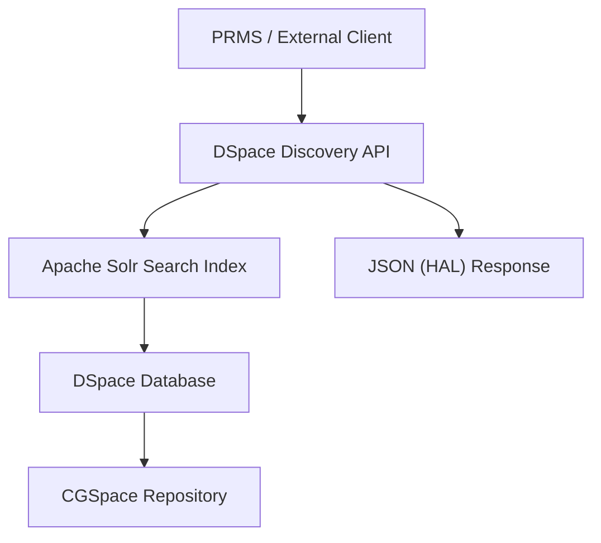
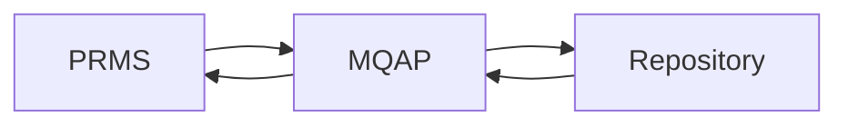
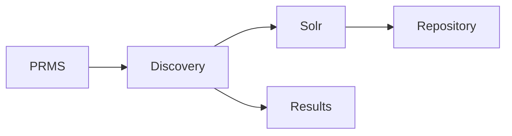
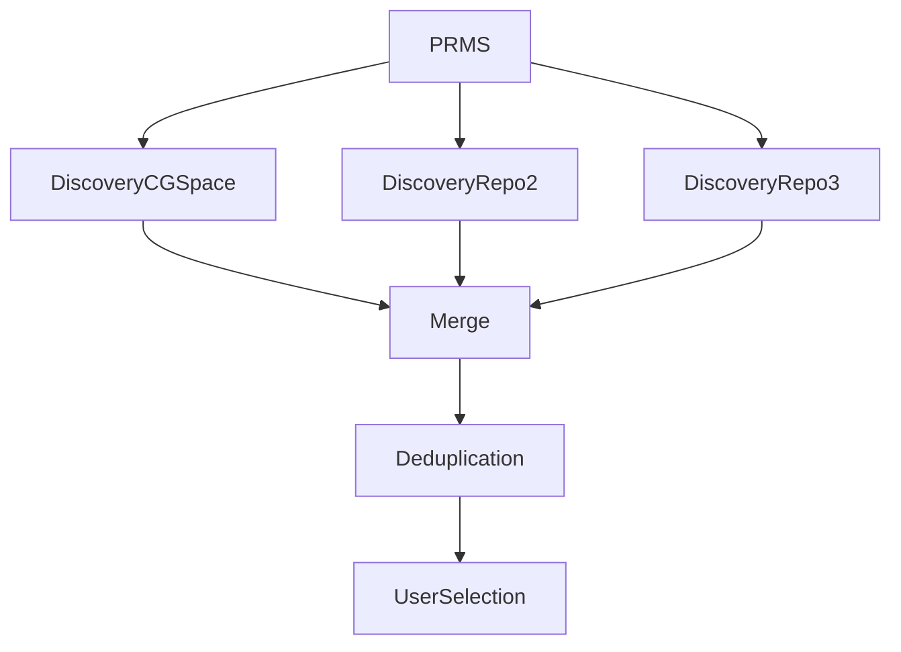

# DSpace Discovery API - Knowledge Products Research Notes

## Overview

The `Discovery API` is the search layer exposed by **DSpace 7**. It is the same search engine that powers the CGSpace web interface and allows external applications to search for and retrieve Knowledge Products (KPs) programmatically.

Unlike MQAP, the Discovery API searches the DSpace search index (Apache Solr) and returns matching repository objects.

## Architecture



Important observations:

- The Discovery API does **not** query the database directly.
- Searches are executed against the Solr search index.
- This enables full-text search, filtering, sorting, faceting, and pagination.

## Discovery endpoint

```http
GET /server/api/discover/search/objects
```

Example:

```http
GET https://cgspace.cgiar.org/server/api/discover/search/objects?dsoType=item&size=20&page=0&sort=dc.date.accessioned,DESC&query=agriculture
```

## Request parameters

### `dsoType`

Determines which DSpace object type is returned:

```text
item
collection
community
```

For Knowledge Products, use:

```text
dsoType=item
```

### `size`

Maximum number of results returned per page.

```text
size=20
```

### `page`

Page number. DSpace uses zero-based pagination internally.

```text
page=0
page=1
page=2
```

### `sort`

Sorts the results. Examples:

```text
dc.date.accessioned,DESC
dc.date.issued,DESC
dc.title,ASC
```

| Field | Purpose |
|---|---|
| `dc.date.accessioned` | Repository upload date |
| `dc.date.issued` | Publication date |
| `dc.title` | Alphabetical title |

### `query`

Free-text search. Examples:

```text
query=agriculture
query=beans
query=climate
```

Internally, this executes a Solr search.

### `scope`

Restricts the search to a specific Community or Collection.

```text
scope=<UUID>
```

This is useful when searching within a single repository section.

### `embed`

Requests additional related resources, reducing the need for additional API requests.

```text
embed=thumbnail
embed=bundles/bitstreams
```

## Response structure

The API follows the **HAL (Hypertext Application Language)** standard.

```text
Response
├── page
├── _links
└── _embedded
    └── searchResult
        └── objects[]
```

### `page`

Contains pagination metadata:

```json
{
  "size": 20,
  "number": 0,
  "totalElements": 1258,
  "totalPages": 63
}
```

It provides the current page, page size, total records, and total pages.

### `_links`

Contains navigation links, typically including `self`, `first`, `previous`, `next`, and `last`. These links allow clients to navigate without manually constructing URLs.

### `_embedded.searchResult.objects`

Contains the matching Knowledge Products. Each result typically contains:

```text
Object
├── UUID
├── Handle
├── Search Score
└── indexableObject
```

### `indexableObject`

The `indexableObject` is the actual Knowledge Product. Most business-relevant information is contained in this object.

## Relevant metadata

| Field | Description |
|---|---|
| UUID | Internal DSpace identifier |
| Handle | Permanent repository identifier |
| `dc.title` | Knowledge Product title |
| `dc.contributor.author` | Authors |
| `dc.date.issued` | Publication date |
| `dc.date.accessioned` | Repository upload date |
| `dc.description.abstract` | Abstract |
| `dc.identifier.uri` | Permanent URL |
| `dc.identifier.doi` | DOI |
| `dc.subject` | Keywords |
| `dc.language` | Language |
| `dc.type` | Article, Dataset, Report, etc. |
| `dc.publisher` | Publisher |

CGIAR repositories may also expose custom metadata such as:

- `cg.identifier.project`
- `cg.coverage.country`
- `cg.coverage.region`
- `cg.contributor.center`
- `cg.subject.agrovoc`

## Metadata recommended for PRMS

The following fields appear sufficient to build the Knowledge Product selector:

| Metadata | Usage |
|---|---|
| Handle | Unique identifier |
| Title | Display |
| Authors | Additional information |
| Publication Date | Ordering |
| Type | Display |
| DOI | External reference |
| URI | Open repository record |
| Center | Filtering |
| Project | Filtering |

## Filtering capabilities

The Discovery API supports more than keyword search:

- Full-text search
- Sorting
- Pagination
- Scope filtering
- Date filtering
- Metadata filtering, depending on repository configuration
- Faceting, where enabled by the repository configuration

## Filtering by year

### Publication year

The recommended field for publication-year filtering is `dc.date.issued`:

```text
dc.date.issued:[2026-01-01T00:00:00Z TO 2026-12-31T23:59:59Z]
```

This retrieves Knowledge Products published during 2026.

### Repository upload date

Alternatively, use `dc.date.accessioned`:

```text
dc.date.accessioned:[2026-01-01T00:00:00Z TO 2026-12-31T23:59:59Z]
```

This returns items uploaded to the repository during 2026, regardless of their publication date.

## MQAP versus Discovery API

This investigation clarified an important architectural distinction.

### MQAP

MQAP does **not** maintain a catalog of Knowledge Products. It:

1. Receives a Handle.
2. Queries the repository.
3. Returns metadata.
4. Discards the result.

It is essentially a lookup service and does not harvest repository contents.



### Discovery API

The Discovery API is intended to search the repository through its Solr-backed index:



This makes it the appropriate service for building searchable Knowledge Product lists.

## Implications for PRMS

The initial assumption was that MQAP exposed an endpoint listing all published Knowledge Products. The clarification from MQAP maintainers was that:

- MQAP has no stored catalog.
- MQAP resolves individual Handles only.
- Repository listing should be performed directly through DSpace Discovery.

Recommended architecture:



## Duplicate detection

Because multiple repositories may contain the same Knowledge Product under different Handles, duplicate detection should likely rely on a combination of:

- DOI
- Title
- Type
- Authors
- Publication date

Handle alone is not sufficient for cross-repository deduplication.

## Recommended integration strategy

1. Query each DSpace repository through its Discovery API.
2. Retrieve Knowledge Products page by page.
3. Merge the results.
4. Remove duplicates.
5. Cache results when appropriate.
6. Expose the unified catalog to PRMS.
7. Continue using MQAP for detailed metadata lookup by Handle when required.

## Example queries

Retrieve latest Knowledge Products:

```http
GET /server/api/discover/search/objects?dsoType=item&sort=dc.date.accessioned,DESC
```

Search by keyword:

```http
GET /server/api/discover/search/objects?dsoType=item&query=agriculture
```

Retrieve page 2:

```http
GET /server/api/discover/search/objects?dsoType=item&page=1&size=20
```

Retrieve only 2026 publications:

```http
GET /server/api/discover/search/objects?dsoType=item&query=dc.date.issued:[2026-01-01T00:00:00Z TO 2026-12-31T23:59:59Z]
```

When used as a URL query parameter, the Solr query should be URL-encoded by the client.

## Key findings

- The Discovery API is the correct endpoint for searching Knowledge Products.
- It uses the Solr search index rather than direct database queries.
- Responses follow the HAL standard.
- Pagination, sorting, and searching are built in.
- Year filtering is supported through indexed date fields.
- MQAP should not be considered a catalog service.
- PRMS should build its Knowledge Product selector using Discovery APIs from the relevant repositories and use MQAP only for Handle-based metadata resolution.

## References

- DSpace REST API v7
- DSpace Discovery Module documentation
- CGSpace DSpace 7 REST endpoints
- MQAP technical clarification provided by Mohammad Salem (CodeObia)

## Validation status

These notes document the research findings and intended integration model. The exact available metadata fields, filters, embedded resources, and production endpoint behavior should be validated against each target repository before implementation, because DSpace configuration and indexed fields can vary between repositories.
