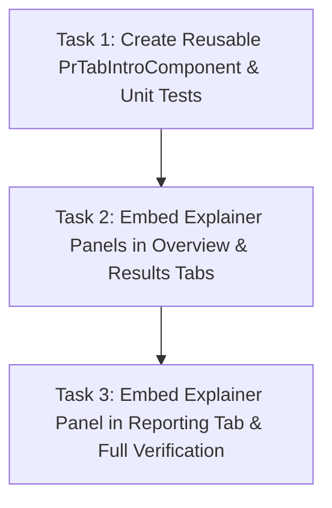

# Tasks: Science Program Tab Explainer Panels

## Document Control

- **Spec Path:** `docs/specs/changes/sp-tab-explainer-panels`
- **Tasks Path:** `docs/specs/changes/sp-tab-explainer-panels/tasks.md`
- **Status:** `ready`
- **Type:** `Change`
- **Approval Mode:** `gated`
- **Total Tasks:** 3

---

## 1. Implementation Plan

---

## 2. Task Breakdown

### Task 1: Create Reusable `PrTabIntroComponent` and Unit Tests
- **Status:** `[x]`
- **Size:** Small (~60 LOC)
- **Dependencies:** None
- **Requirements Covered:** `STEP-R-1`, `STEP-R-2`, `STEP-R-3`, `STEP-NFR-1`, `STEP-NFR-3`
- **Design References:** `design.md §4`, `design.md §5`, `DD-1`, `DD-2`, `DD-3`
- **Skills:** `angular-developer`, `frontend-design`
- **Files to Create/Modify:**
  - `onecgiar-pr-client/src/app/shared/components/pr-tab-intro/pr-tab-intro.component.ts`
  - `onecgiar-pr-client/src/app/shared/components/pr-tab-intro/pr-tab-intro.component.html`
  - `onecgiar-pr-client/src/app/shared/components/pr-tab-intro/pr-tab-intro.component.scss`
  - `onecgiar-pr-client/src/app/shared/components/pr-tab-intro/pr-tab-intro.component.spec.ts`
- **Scope:**
  - Implement standalone component `PrTabIntroComponent` with inputs `title`, `description`, `icon`, `defaultOpen`.
  - Add reactive `isOpen = signal<boolean>(true)` with `toggle()` method.
  - Implement accessible HTML with semantic `<button>`, `role="region"`, `[attr.aria-expanded]="isOpen()"`.
  - Author comprehensive Jest tests verifying default open rendering, collapse toggle, re-expansion, and text bindings.
- **Done Criteria:**
  - [ ] `PrTabIntroComponent` is exported and usable as a standalone component.
  - [ ] Tests in `pr-tab-intro.component.spec.ts` pass with 100% coverage.

---

### Task 2: Embed Explainer Panels in Overview and Results Tabs
- **Status:** `[x]`
- **Size:** Small (~40 LOC)
- **Dependencies:** `Task 1`
- **Requirements Covered:** `STEP-R-1.1`, `STEP-R-4 (Overview)`, `STEP-R-4 (Results)`
- **Design References:** `design.md §6.1`, `design.md §6.2`
- **Skills:** `angular-developer`
- **Files to Modify:**
  - `onecgiar-pr-client/src/app/pages/result-framework-reporting/pages/dashboard-lab/components/program-overview/program-overview.component.ts`
  - `onecgiar-pr-client/src/app/pages/result-framework-reporting/pages/dashboard-lab/components/program-overview/program-overview.component.html`
  - `onecgiar-pr-client/src/app/pages/result-framework-reporting/pages/programme-results/programme-results.component.ts`
  - `onecgiar-pr-client/src/app/pages/result-framework-reporting/pages/programme-results/programme-results.component.html`
- **Scope:**
  - Import `PrTabIntroComponent` into `ProgramOverviewComponent` and embed at the top of the Overview view with the approved Overview text.
  - Import `PrTabIntroComponent` into `ProgrammeResultsComponent` and embed at the top of the Results view with the approved Results text.
  - Verify existing tests in `program-overview` and `programme-results` pass.
- **Done Criteria:**
  - [ ] Overview tab renders the Overview explanation banner open by default.
  - [ ] Results tab renders the Results explanation banner open by default.
  - [ ] Unit tests for both components pass.

---

### Task 3: Embed Explainer Panel in Reporting Tab & Full Verification
- **Status:** `[x]`
- **Size:** Small (~30 LOC)
- **Dependencies:** `Task 1`, `Task 2`
- **Requirements Covered:** `STEP-R-1.2`, `STEP-R-4 (Reporting)`, `STEP-NFR-2`
- **Design References:** `design.md §6.3`
- **Skills:** `angular-developer`
- **Files to Modify:**
  - `onecgiar-pr-client/src/app/pages/result-framework-reporting/pages/dashboard-lab/components/reporting-program-band/reporting-program-band.component.ts`
  - `onecgiar-pr-client/src/app/pages/result-framework-reporting/pages/dashboard-lab/components/reporting-program-band/reporting-program-band.component.html`
- **Scope:**
  - Import `PrTabIntroComponent` into `ReportingProgramBandComponent` (or `dashboard-lab.component.html`) and render above the ToC reporting area when on the Reporting tab.
  - Run full Jest test suite across `result-framework-reporting` (`npx jest --silent`).
  - Run linter verification (`npx ng lint --quiet`).
- **Done Criteria:**
  - [ ] Reporting tab renders the Reporting explanation banner open by default.
  - [ ] All 19+ test suites in `dashboard-lab` pass.
  - [ ] `ng lint` returns 0 errors.

---

## 3. Traceability Matrix

| Requirement | Task | Test Verification |
| :--- | :--- | :--- |
| `STEP-R-1` (Default Open) | Task 1, Task 2, Task 3 | `pr-tab-intro.component.spec.ts` |
| `STEP-R-2` (Collapse/Expand) | Task 1 | `pr-tab-intro.component.spec.ts` |
| `STEP-R-3` (Volatile State) | Task 1 | `pr-tab-intro.component.spec.ts` |
| `STEP-R-4` (Copy Fidelity) | Task 2, Task 3 | Component template snapshots & specs |
| `STEP-NFR-1` (A11y & Contrast) | Task 1 | `pr-tab-intro.component.spec.ts` (`aria-expanded`) |
| `STEP-NFR-2` (Zero Side Effects) | Task 3 | Regression suites pass |
| `STEP-NFR-3` (Design Tokens) | Task 1 | SCSS / Tailwind token review |
