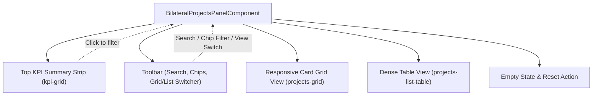

# Bilateral Center Overview & Projects UI/UX Redesign — Design

## 1. Document Control & Executive Summary

| Attribute | Value |
|---|---|
| **Spec Path** | `docs/specs/bilateral/overview-redesign/` |
| **Design File** | `docs/specs/bilateral/overview-redesign/design.md` |
| **Requirements Ref** | [`docs/specs/bilateral/overview-redesign/requirements.md`](file:///Users/jcadavid/orca/workspaces/onecgiar_pr/qa-development-2026/docs/specs/bilateral/overview-redesign/requirements.md) |
| **Audit Ref** | [`docs/specs/bilateral/overview-redesign/judgment.md`](file:///Users/jcadavid/orca/workspaces/onecgiar_pr/qa-development-2026/docs/specs/bilateral/overview-redesign/judgment.md) |
| **Visual Mockup** | [`docs/specs/bilateral/overview-redesign/mockup/overview-mockup.html`](file:///Users/jcadavid/orca/workspaces/onecgiar_pr/qa-development-2026/docs/specs/bilateral/overview-redesign/mockup/overview-mockup.html) |
| **Target Component** | `onecgiar-pr-client/src/app/pages/bilateral/pages/bilateral-home/components/bilateral-projects-panel/` |
| **Complexity / Depth** | Standard |

### Executive Summary
This design specifies the architectural, component, state, and accessibility specifications for the Bilateral Projects Overview panel. It leverages Angular 21 Standalone Components, reactive signals (`signal`, `computed`, `effect`), and Tailwind CSS utility classes aligned with the 2026 PRMS design tokens (`--pr-color-primary-*`, `--pr-color-secondary-*`, PrimeIcons).

The design introduces a high-craft dashboard experience with zero backend modifications, utilizing existing payloads from `GET /api/bilateral/projects/:centerId`.

---

## 2. Architecture Overview

### 2.1 Component Tree & Placement

```
onecgiar-pr-client/src/app/pages/bilateral/
├── pages/bilateral-home/
│   ├── bilateral-home.component.html
│   │   ├── <app-bilateral-page-header activeTab="overview" />
│   │   └── <app-bilateral-projects-panel />
│   └── components/bilateral-projects-panel/
│       ├── bilateral-projects-panel.component.ts      (Signals state, KPI computations, filter logic, session persistence)
│       ├── bilateral-projects-panel.component.html    (KPI cards, toolbar, responsive grid cards, dense table, empty state)
│       └── bilateral-projects-panel.component.scss    (Tailwind theme hooks & micro-interaction styles)
```

### 2.2 Component UI Sub-Structure



---

## 3. Data Model & State Management

### 3.1 Interfaces (Unchanged / Consumed from Service)

The existing `BilateralProject` interface in `src/app/pages/bilateral/services/bilateral-creation.interfaces.ts` is fully sufficient:
- `id: number`
- `shortName: string` (e.g. `B-A1080`)
- `fullName: string` (e.g. Project title)
- `summary: string | null`
- `description: string | null`
- `leadCenter: { id: number, name: string, acronym: string } | null`
- `sciencePrograms: ScienceProgramMapping[]` (`programId`, `programCode`, `allocation`, `spName`, `spShortName`)

### 3.2 Internal Reactive Signals & Session Persistence

In `BilateralProjectsPanelComponent`:

| Signal Name | Type | Purpose | Persistence |
|---|---|---|---|
| `projects` | `WritableSignal<BilateralProject[]>` | Source list of projects loaded for current center. | In-memory |
| `loading` | `WritableSignal<boolean>` | Loading indicator state. | In-memory |
| `error` | `WritableSignal<boolean>` | Error state indicator. | In-memory |
| `searchQuery` | `WritableSignal<string>` | Active text input for debounced search. | In-memory |
| `selectedProgramFilter` | `WritableSignal<string>` | Active Science Program filter (`'ALL'` or specific `spName`/`spShortName`). | In-memory |
| `selectedMultiProgramOnly` | `WritableSignal<boolean>` | Boolean flag to filter projects mapped to >1 program. | In-memory |
| `viewMode` | `WritableSignal<'grid' \| 'list'>` | View toggle preference (`'grid'` or `'list'`). | `sessionStorage` (`pr.bilateral.viewMode`) |
| `kpiSummary` | `Signal<KpiSummary>` | Reactive metric computation: total count, per-program counts, and multi-program count. | In-memory `computed()` |
| `filteredProjects` | `Signal<BilateralProject[]>` | Reactive derivation applying active program filter, multi-program flag, and search query. | In-memory `computed()` |

### 3.3 Center Switching Lifecycle Rule
- Whenever `ctx.centerId()` or `ctx.centerAcronym()` changes:
  - Trigger `GET_bilateralProjects(centerId)`.
  - Reset `searchQuery.set('')`.
  - Reset `selectedProgramFilter.set('ALL')`.
  - Reset `selectedMultiProgramOnly.set(false)`.
  - Retain `viewMode` from `sessionStorage`.

---

## 4. Frontend & UX Component Architecture

### 4.1 KPI Summary Strip (`kpi-section`)
- Renders accessible interactive cards (`tabindex="0"`, `role="button"`, `[attr.aria-pressed]`) showing:
  - **Total Projects:** Shows `kpiSummary().total`. Clicking sets `selectedProgramFilter = 'ALL'` and `selectedMultiProgramOnly = false`.
  - **Top Science Programs:** Dynamic cards for each program present in the loaded dataset with count `kpiSummary().byProgram[name]`. Clicking sets `selectedProgramFilter = name` and `selectedMultiProgramOnly = false`.
  - **Multi-Program:** Shows `kpiSummary().multiProgramCount`. Clicking sets `selectedMultiProgramOnly = true` and `selectedProgramFilter = 'ALL'`.
- Selected card displays active border (`var(--pr-color-primary-300)`), subtle gradient (`var(--pr-color-primary-25) → var(--pr-color-primary-50)`), and 4px left accent stripe.

### 4.2 Toolbar (`toolbar`)
- **Search input:** With search icon, clear button (`pi pi-times`), accessible `aria-label="Search by project or program"`.
- **Quick filter chips:** Pill buttons (`All`, top programs) synced with `selectedProgramFilter`.
- **View Toggle buttons:** Icon buttons (`pi pi-th-large` for Grid, `pi pi-list` for Table) with `aria-pressed` toggling `viewMode` and storing selection in `sessionStorage`.

### 4.3 Grid View — Responsive Project Cards (`projects-grid`)
- Responsive Tailwind layout: `grid grid-cols-1 md:grid-cols-2 xl:grid-cols-3 gap-5`.
- Card Elements:
  - **Header:** Monospace code badge (`project.shortName`) with `bg-[var(--pr-color-primary-50)]` and `text-[var(--pr-color-primary-500)]` + Active status dot.
  - **Title:** `project.fullName || project.shortName`, 15px font, 700 weight, 2-line clamp (`line-clamp-2`), and native tooltip `[title]`.
  - **Summary:** Optional `project.summary` or `project.description` snippet (2-line clamp).
  - **Science Programs Section:** Grouped container showing program chips with colored left accents (`sp-01`, `sp-02`, etc.) and allocation percentages (`sp.allocation | number:'1.0-0'%`).
  - **Card Footer:** Bottom border divider with `+ Create result` button linked to `/bilateral/:acronym/create` triggering `selectAndCreate(project)`.

### 4.4 List View — Dense Table (`projects-list-table`)
- Table with dark chrome header (`bg-[var(--pr-color-secondary-500)]`), columns:
  1. `Code` (width: 120px) — Monospace code badge.
  2. `Project Title` — Full title with active indicator subtitle.
  3. `Science Programs & Allocations` (width: 280px) — Program allocation chips.
  4. `Action` (width: 140px, right-aligned) — `+ Create result` button.

### 4.5 Empty & Error States
- **Empty State:** Displayed when `filteredProjects().length === 0` and `projects().length > 0`.
  - Headline: `"No projects match your filter criteria"`.
  - Action: Primary button `"Reset Filters"` calling `resetAllFilters()`.
- **Error State:** Displayed when `error()` is true with retry action.

### 4.6 Accessibility Specification (a11y)
- All KPI cards, filter chips, and view buttons support keyboard activation via `Enter` and `Space`.
- Focus outlines use `focus-visible:ring-2 focus-visible:ring-[var(--pr-color-primary-300)]`.
- Screen readers receive clear labels (`aria-label="Filter by Science Program Breeding for Tomorrow, 2 projects available"`).

---

## 5. Design Decisions (ADRs)

### `BIL-DD-1` — In-Memory Reactive Filtering over Server Round-Trips
- **Context:** The number of bilateral projects per center typically ranges from 5 to 50 projects.
- **Decision:** Load all active projects for the center once via `GET_bilateralProjects(centerId)` and compute all KPI aggregations and multi-attribute filters in-memory using Angular `computed()` signals.
- **Consequences:** Instant UI responsiveness (<10ms) for searching, chip clicking, and KPI card toggling with zero server load.

### `BIL-DD-2` — Dual View Toggle with Session Storage Retention
- **Context:** Casual submitters benefit from rich visual cards; high-volume coordinators prefer a dense table.
- **Decision:** Provide a switcher between Card Grid and Table View in the toolbar, persisting the user's choice in `sessionStorage`.
- **Consequences:** Satisfies both visual appeal and operational density without resetting on page refresh.

### `BIL-DD-3` — Full Title Surface with 2-Line Clamp & Fallback
- **Context:** Project titles vary from short phrases to long academic titles.
- **Decision:** Render `fullName` as the primary heading in cards with CSS `line-clamp-2`, `overflow-hidden`, full tooltip on `[title]`, and fallback to `shortName` if `fullName` is missing.
- **Consequences:** Card heights remain clean and uniform across columns while allowing full title inspection.

---

## 6. Sizing & Budget (Tripwire)

| Metric | Budget Target | Rationale |
|---|---|---|
| **Expected Tasks** | 3 tasks | `T1` Signal & KPI logic in TS; `T2` HTML/SCSS template & styles; `T3` Unit tests. |
| **Expected LOC** | ~220 LOC | Purely frontend component refactoring + test suite. |
| **Expected Review Rounds** | 1 round | Clean bounded change with high-fidelity mockup reference. |

---

## 7. Next Step

```text
/akili-specify bilateral/overview-redesign (Phase 3: tasks.md)
```
