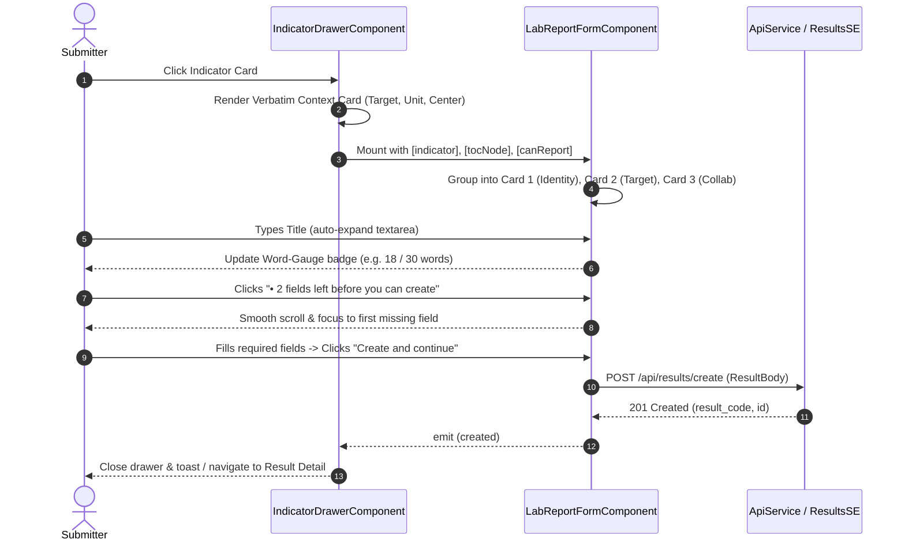

# Module Spec — Design: Report Result Form UX & Standardized Form Patterns

## Document Control

- **Spec Path:** `docs/specs/changes/report-result-form-ux/design.md`
- **Module:** `results` / `dashboard-lab` (Reporting Entry Drawer & Forms)
- **Sub-feature:** `report-result-form-ux`
- **Owner:** Results & UX/UI Core Team
- **Status:** `in-review`
- **Type:** Change
- **Approval Mode:** gated
- **Requirements Ref:** `docs/specs/changes/report-result-form-ux/requirements.md`
- **Constitutional Cross-References:**
  - `docs/prd.md` (§3 Personas, G1, US-S1, AC-1, AC-2)
  - `docs/ux-ui/design.md` (§6 Drawers & modals, §7 Design tokens, §8 Component patterns, §10 Accessibility)
  - `docs/trd/trd.md` (§4 Result reporting flow, W1)

---

## 1. Summary

This design defines the technical architecture, component layout, and reactive interactions for redesigning the **"Report result"** slide-over drawer (`indicator-drawer`) and its creation form (`lab-report-form`). It elevates the visual craft using the OneCGIAR 2026 brand system (violet gradient `#6b6dc4 → #6461bc`, 4/8px spacing rhythm, WCAG AA contrast) and implements the **PRMS Form UX Pattern** without altering backend APIs or payload contracts.

The design strictly respects the user decision to **preserve all indicator description text verbatim** (retaining `.---`, `------`, etc.), while wrapping it in a structured context card and chunking the form into 3 logical visual cards (*Identity*, *Target*, *Collaboration*).

---

## 2. Architecture Overview

### 2.1 Where this lives in the system

- **Server modules touched:** None. The payload sent to `api/results/create` is 100% backward compatible.
- **Client modules touched:**
  - `onecgiar-pr-client/src/app/pages/result-framework-reporting/pages/dashboard-lab/components/indicator-drawer/`
  - `onecgiar-pr-client/src/app/pages/result-framework-reporting/pages/dashboard-lab/components/lab-report-form/`
  - `onecgiar-pr-client/src/app/pages/result-framework-reporting/pages/dashboard-lab/components/indicator-drawer/components/` (optional micro-components)
  - `docs/ux-ui/design.md` (documentation update for PRMS Form UX pattern)
- **External integrations touched:** None.

### 2.2 Sequence & Component Hierarchy



---

## 3. Data Model Changes

### 3.1 Entities
No database schema or entity changes required.

### 3.2 Migrations
No database migrations required.

---

## 4. API Surface

### 4.1 Endpoints
The existing endpoint `POST /api/results/create` remains unchanged.

```typescript
interface CreateResultBody {
  result_name: string;
  result_type_id: number;
  indicator_id?: number;
  contribution_to_indicator_target?: number;
  contributing_centers?: Array<{ code: string }>;
  contributing_initiatives?: Array<{ id: number }>;
  bilateral_projects?: Array<{ project_id: string }>;
  handler?: string;
  extra_information?: string;
}
```

---

## 5. Server Workflow / Business Rules

No server changes. Existing authorization, validation, and TypeORM operations in `ResultsController` and `ResultsService` remain in effect.

---

## 6. Frontend Plan & UI/UX Component Architecture

### 6.1 Layout & Visual Structure

```text
┌─────────────────────────────────────────────────────────────┐
│ Header: [icon] Report result                            [X] │
├─────────────────────────────────────────────────────────────┤
│ 1. Verbatim Indicator Context Card                          │
│    ├── SP01 • HLO1.AOW1.IO1 Steer to impact         [ʌ / v] │
│    ├── Raw description (preserved: .--- IRRI ... ------ )   │
│    └── Metadata Grid: [Target: 15] [Unit: X] [Center: IRRI] │
├─────────────────────────────────────────────────────────────┤
│ 2. Empty State Micro-Card (if 0 existing results reported)  │
│    "No results reported yet. Your report will be first."    │
├─────────────────────────────────────────────────────────────┤
│ 3. Form Card 1: Result Identity                             │
│    ├── Indicator Category (if choice needed)                │
│    └── Result Title (auto-resizing textarea, 0/30 badge)    │
│        └── Inline helper: "Provide a clear, concise title…" │
├─────────────────────────────────────────────────────────────┤
│ 4. Form Card 2: Target Contribution                         │
│    ├── Contribution Input + Unit Suffix ([ 15 ] varieties)  │
│    └── Contextual helper: "Target 2026: 15 · Achieved: 0"   │
├─────────────────────────────────────────────────────────────┤
│ 5. Form Card 3: Collaboration & Attribution                 │
│    ├── CGIAR Centers (Lead Center locked badge + others)    │
│    ├── Science Programs (tokenized combobox)                │
│    └── Bilateral / W3 Projects                              │
├─────────────────────────────────────────────────────────────┤
│ Sticky Footer:                                              │
│ [• 2 fields left (interactive)]    [Cancel]  [Create CTA]   │
└─────────────────────────────────────────────────────────────┘
```

### 6.2 Component Details

#### 1. `IndicatorDrawerComponent`
- **File:** `indicator-drawer.component.html` & `.ts`
- **Verbatim Text Guarantee (`RFUX-R-1`):** The template directly binds `{{ indicator()?.indicator_description }}` without any sanitization filters or string replacements.
- **Context Card Styling:** Wrap in a clean rounded card (`rounded-xl border border-[var(--pr-border)] bg-[var(--pr-surface-app)] p-3.5`).
- **Metadata Badges:**
  - Target badge: `bg-violet-50 text-[var(--pr-color-primary-400)] border border-violet-200 font-semibold`.
  - Center badge: `bg-gray-50 text-gray-700 border border-gray-200 font-medium`.
  - Unit badge: `bg-slate-50 text-slate-700 border border-slate-200`.

#### 2. `LabReportFormComponent`
- **File:** `lab-report-form.component.html` & `.ts`

##### Card 1: Result Identity (`RFUX-R-2`, `RFUX-R-3`)
- Encapsulated in `<section class="rounded-xl border border-[var(--pr-border)] bg-white p-4.5 shadow-2xs">`.
- Section title: `<h4 class="text-[13.5px] font-bold text-[var(--pr-color-secondary-400)] mb-3 flex items-center gap-2">`.
- **Title Control:**
  - Implement an auto-resizing `<textarea>`:
    ```html
    <textarea
      #titleInput
      rows="2"
      [ngModel]="createResultBody().result_name"
      (ngModelChange)="onTitleChange($event)"
      placeholder="Brief, descriptive title for this result…"
      class="w-full rounded-[10px] border border-[var(--pr-border)] p-3 text-[13.5px] leading-relaxed resize-none transition-all focus:border-[var(--pr-color-primary-300)] focus:ring-2 focus:ring-[var(--pr-color-primary-100)]"
      [maxlength]="250"></textarea>
    ```
  - **Dynamic Word Counter (`RFUX-R-3`):**
    - Calculated via reactive signal: `titleWordCount = computed(() => countWords(this.createResultBody().result_name))`.
    - Pill styling with warning ramps:
      - `0..24 words`: `bg-gray-100 text-gray-600`
      - `25..29 words`: `bg-amber-50 text-amber-700 border border-amber-200`
      - `30 words`: `bg-violet-50 text-[var(--pr-color-primary-400)] border border-violet-300 font-bold`
      - `>30 words`: `bg-red-50 text-red-700 border border-red-300 font-bold`

##### Card 2: Target Contribution (`RFUX-R-4`)
- Encapsulated in `<section class="rounded-xl border border-[var(--pr-border)] bg-white p-4.5 shadow-2xs">`.
- Input layout:
  ```html
  <div class="relative flex items-center max-w-[260px]">
    <input
      #contributionInput
      type="number"
      min="0"
      placeholder="e.g. 5"
      [ngModel]="createResultBody().contribution_to_indicator_target"
      (ngModelChange)="patch('contribution_to_indicator_target', $event)"
      class="w-full rounded-[10px] border border-[var(--pr-border)] pl-3 pr-16 py-2.5 text-[14px] font-semibold text-gray-900" />
    @if (unitMeasurement()) {
      <span class="pointer-events-none absolute right-3 text-xs font-medium text-gray-500">
        {{ unitMeasurement() }}
      </span>
    }
  </div>
  ```
- **Contextual Target Reference:** Directly below the input:
  `<p class="text-[12px] text-gray-500 mt-1.5 flex items-center gap-1.5">` showing total 2026 Target and achieved sum.

##### Card 3: Collaboration & Attribution (`RFUX-R-7`)
- Encapsulated in `<section class="rounded-xl border border-[var(--pr-border)] bg-white p-4.5 shadow-2xs">`.
- **Lead Center Protection (`RFUX-R-7`):**
  - Lead Center (e.g. `IRRI`) is rendered as a prominent chip with a `Lead Center` badge (`bg-violet-50 text-violet-800 border border-violet-200`) and NO dismiss button.
  - Contributing Centers added by the user render with standard dismissible `(x)` chips.

##### Interactive Sticky Footer (`RFUX-R-6`)
- `missingFields` status is an interactive `<button type="button" (click)="focusFirstMissingField()">`:
  ```typescript
  focusFirstMissingField(): void {
    if (!this.createResultBody().result_type_id && this.needsCategoryChoice()) {
      this.categorySelect()?.focus?.();
      return;
    }
    if (!this.createResultBody().result_name?.trim()) {
      this.titleInput()?.nativeElement?.focus();
      this.titleInput()?.nativeElement?.scrollIntoView({ behavior: 'smooth', block: 'center' });
      return;
    }
    if (this.createResultBody().contribution_to_indicator_target == null) {
      this.contributionInput()?.nativeElement?.focus();
      this.contributionInput()?.nativeElement?.scrollIntoView({ behavior: 'smooth', block: 'center' });
      return;
    }
  }
  ```
- Primary submit CTA uses official brand gradient:
  `bg-gradient-to-r from-[var(--pr-color-primary-300)] to-[var(--pr-color-primary-400)] text-white shadow-sm hover:opacity-95`.

---

## 7. Security & Authorization

- All interactions remain guarded by existing `canReport()` checks derived from `EntityAowService` and `RolesService`.
- No sensitive or confidential data stored in localStorage.
- Standard client-side HTML sanitization prevents any XSS injection.

---

## 8. Performance & Capacity

- Pure CSS and Angular reactive signal updates for the word counter and auto-resizing textarea.
- Zero extra HTTP roundtrips introduced.
- Responsive layout handles drawer resize without reflow jitter.

---

## 9. Observability & Telemetry

- Standard result creation logging on success or error through `ApiService`.
- No secrets or credentials logged.

---

## 10. Testing Plan

- **Unit Tests:**
  - `lab-report-form.component.spec.ts`:
    - Tests 3-section card rendering.
    - Tests word counter badge changes from neutral -> amber -> purple.
    - Tests `focusFirstMissingField()` focuses the correct missing field.
    - Tests lead center chip has no remove button.
    - Tests empty initial contribution value.
  - `indicator-drawer.component.spec.ts`:
    - Tests that raw indicator text `.--- IRRI ...` is rendered verbatim without character stripping.
    - Tests empty state micro-card rendering when results count is 0.
- **Accessibility Checks:**
  - Tab navigation order.
  - Color contrast verification $\ge$ 4.5:1 on badges, labels, and buttons.

---

## 11. Design Decisions (ADRs)

### `RFUX-DD-1` — 3-Card Scannable Scroll vs Multi-Step Wizard
- **Context:** Form has 6 fields. Some users find flat lists overwhelming, but full wizards require multiple clicks.
- **Decision:** Use a single scrollable drawer chunked into 3 distinct visual cards.
- **Alternatives Considered:**
  1. *3-step Wizard:* Rejected because it introduces unnecessary click friction for a 6-field shell.
  2. *Flat un-chunked list:* Rejected because it causes visual fatigue and poor scanning.
- **Consequences:** Users can see the full result context at a glance while benefiting from clear cognitive boundaries.

### `RFUX-DD-2` — Auto-resizing Multi-line Textarea for Title
- **Context:** Scientific result titles average 15–25 words and cannot be read easily in a single-line input.
- **Decision:** Replace single-line `<input>` with auto-expanding `<textarea>` (min 2 rows, max 4 rows).
- **Alternatives Considered:** Single-line input with horizontal scrolling (rejected for poor readability).
- **Consequences:** Significantly better title review and editing experience before creation.

### `RFUX-DD-3` — Verbatim Indicator Text Preservation
- **Context:** Upstream indicator descriptions contain characters like `.---` or `------`.
- **Decision:** Keep all text verbatim without regex stripping, per explicit user instruction (2026-09-05).
- **Alternatives Considered:** Automated regex cleaner (rejected per user requirement).
- **Consequences:** Zero risk of stripping intentional user-documented notations.

### `RFUX-DD-4` — Interactive Readiness Action in Footer
- **Context:** Footer currently shows `• 3 fields left` with a dotted line that does nothing.
- **Decision:** Convert to an accessible button that scrolls to and focuses the first invalid field.
- **Alternatives Considered:** Static text without underline, or popover list (rejected in favor of direct 1-click action).
- **Consequences:** Immediate, effortless error resolution for submitters.

---

## 12. Required Cross-References

- Requirements: `docs/specs/changes/report-result-form-ux/requirements.md`
- Design Tokens & Guide: `docs/ux-ui/design.md` §7, §8, §10
- Technical Specifications: `docs/trd/trd.md` §4
