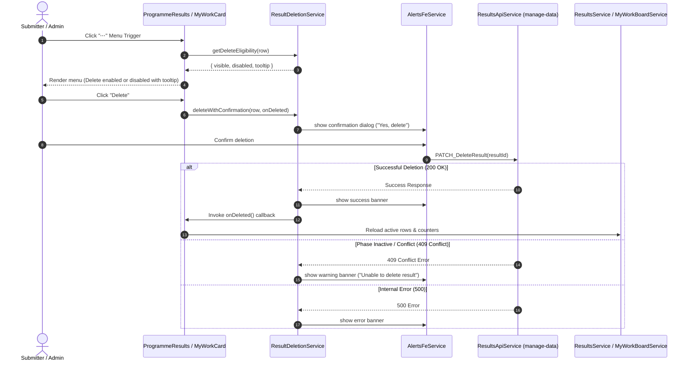

# Design: Delete Result Action in SP Results and My Results

## Document Control

- **Spec Path:** `docs/specs/changes/delete-result-action/design.md`
- **Requirements Reference:** [`docs/specs/changes/delete-result-action/requirements.md`](file:///Users/jcadavid/orca/workspaces/onecgiar_pr/qa-development-2026/docs/specs/changes/delete-result-action/requirements.md)
- **Module:** `results` / `result-framework-reporting`
- **Sub-feature:** `delete-result-action`
- **Type:** Change
- **Approval Mode:** gated
- **Status:** in-review
- **Author:** Antigravity (T1 Architect)
- **Date:** 2026-09-11

---

## 1. Summary

This design establishes the technical blueprint for integrating the **Delete Result** capability into both the Science Program Results table (`programme-results.component`) and the My Results Kanban board (`my-work-card.component`).

The solution introduces a dedicated, shared domain service—`ResultDeletionService`—that encapsulates phase, role, and status permission checks, confirmation dialog invocation, backend deletion execution, feedback alerting, and error handling. The SP Results table menu incorporates a destructive "Delete" action separated by a divider, while My Results cards gain a CDK Connected Overlay action menu trigger ensuring overlay visibility without column scroll clipping.

---

## 2. Architecture Overview

### 2.1 System Placement
- **Server Surfaces:** Unchanged. Reuses existing `DELETE /api/manage-data/result/:id/delete` implemented by `DeleteRecoverDataController` and `DeleteRecoverDataService`.
- **Client Modules Touched:**
  - `src/app/pages/result-framework-reporting/services/result-deletion.service.ts` (New shared service).
  - `src/app/pages/result-framework-reporting/pages/programme-results/` (`programme-results.component.ts`, `programme-results.component.html`).
  - `src/app/pages/result-framework-reporting/pages/my-work-board/components/my-work-card/` (`my-work-card.component.ts`, `my-work-card.component.html`).
  - `src/app/pages/result-framework-reporting/pages/my-work-board/` (`my-work-board.component.ts`).

### 2.2 Interaction Flow Diagram

---

## 3. Data Model & Migrations

### 3.1 Entities
No entity modifications required. Soft deletion operates directly on the existing `Result` entity (`is_active = 0`) and registers audit records in `ResultDeletionAudit`.

### 3.2 Migrations
No database migrations required.

---

## 4. API Surface

The implementation consumes the existing endpoint without changes:

| Field | Contract |
|---|---|
| **Method + Path** | `DELETE /api/manage-data/result/{id}/delete` |
| **Client Method** | `api.resultsSE.PATCH_DeleteResult(resultId: string \| number)` |
| **Auth** | JWT Required (`custom: auth <JWT>`) |
| **RBAC** | Admin OR Lead (`3`) / Co-Lead (`4`) / Coordinator (`5`) |
| **Response** | `200 OK` on logical deletion; `400 Bad Request` if QAed (`status_id = 2`); `409 Conflict` if phase inactive. |

---

## 5. Server Workflow / Business Rules

The backend rules executed by `DeleteRecoverDataService.deleteResult` are satisfied without alteration:
1. Verifies result exists in `_resultRepository`.
2. Validates user has Admin or Role `[3, 4, 5]` for the result.
3. Rejects with `400 Bad Request` if `status_id == 2` ("Is already Quality Assessed").
4. Rejects with `409 Conflict` if `version.is_active != true` or `version.status != true`.
5. Logs audit event via `_resultDeletionAuditService.recordDeletion(...)`.
6. Performs logical soft deletion across all child entity repositories.

---

## 6. Frontend Architecture & Implementation Plan

### 6.1 Shared Domain Service: `ResultDeletionService`
Located at `src/app/pages/result-framework-reporting/services/result-deletion.service.ts`:

- **Responsibilities:**
  - Evaluates eligibility via `getDeleteEligibility(result: ProgrammeResultRow | Record<string, any>)`:
    - `visible`: `reportingCurrentPhase.portfolioAcronym === raw.acronym`.
    - `disabled`:
      - If `raw.status_id == 2`: `true` (Tooltip: `"You are not allowed to perform this action because the result is in the status \"QAed\"."`).
      - If user is Admin: `false` (can delete anything not QAed).
      - If non-Admin and `raw.role_id` NOT in `[3, 4, 5]`: `true` (Tooltip: `"You are not allowed to perform this action. Please contact your leader or co-leader."`).
      - Otherwise: `false` (Tooltip: `""`).
  - Orchestrates deletion dialog via `deleteWithConfirmation(row, callbacks)`:
    - Launches `api.alertsFe.show` confirmation modal.
    - Manages deletion in-flight state.
    - Calls `api.resultsSE.PATCH_DeleteResult(row.id)`.
    - Shows success alert and invokes `callbacks.onSuccess()`.
    - Intercepts errors (409 warning vs generic error alert).

### 6.2 SP Results Table (`programme-results.component`)
- **Row Menu Extension:**
  - Adds divider `
` below navigation items.
  - Adds `<button role="menuitem">` for Delete:
    - Destructive styling: `text-[var(--pr-color-red-600)] hover:bg-[var(--pr-color-red-50)]`.
    - Trash icon (`pi pi-trash` or `lucideTrash2`).
    - Tooltip directive binding when `disabled` is true.
  - On click, triggers `resultDeletionService.deleteWithConfirmation` passing a refresh callback:
    `() => this.data.load(this.programmeCode())`.

### 6.3 My Results Card (`my-work-card.component` & `my-work-board.component`)
- **Card Action Menu:**
  - Adds a kebab action trigger (`<button aria-label="More actions">` with `lucideMoreHorizontal` or `pi pi-ellipsis-h`) to the card header next to the origin label.
  - Uses Angular CDK Connected Overlay (`cdkConnectedOverlay`) to render the action menu in `.cdk-overlay-container` on `<body>`. This prevents any clipping from column `overflow-y: auto`.
  - Action items:
    1. *Download PDF* (links to `pdfHref(row)`).
    2. *Copy link* (copies deep link to result detail).
    3. Divider.
    4. *Delete* (uses `resultDeletionService`).
  - Upon successful deletion:
    - Emits output `(deleted)="onCardDeleted($event)"` to `my-work-board.component`.
    - `my-work-board.component` invokes `this.boardService.load(this.programmeCode())` and `this.countSE.refresh()`.

---

## 7. Security, Authorization & Audit

- **Client Enforcement:** Client gates proactively disable or hide the delete action, preventing unauthorized clicks and providing instant, helpful feedback via tooltips.
- **Defense in Depth:** The backend endpoint independently re-validates JWT ownership and role permissions (`validationRolePermissions`).
- **Audit Logging:** Every deletion records the authenticated actor and timestamp in the database audit log.

---

## 8. Performance & UI Constraints

- **Zero Bundle Bloat:** Reuses existing CDK Overlay, Lucide/PrimeNG icons, and `alertsFe` service.
- **Scroll Container Escape:** The CDK Connected Overlay strictly avoids column overflow boundaries.
- **Targeted Reload:** Only the active Science Program's dataset is re-fetched on deletion, leaving unrelated cache and router states untouched.

---

## 9. Design Decisions (ADRs)

### `DEL-DD-1` — Shared `ResultDeletionService` vs Component Duplication
- **Context:** Deletion logic and validation rules must be identical across Results Center, SP Results, and My Results.
- **Decision:** Implement `ResultDeletionService` in `src/app/pages/result-framework-reporting/services/` to own all permission rules, tooltips, dialogs, and deletion calls.
- **Alternatives Considered:**
  1. *Duplicate in both components:* Rejected due to code drift and testing overhead.
  2. *Global dialog component:* Rejected as `api.alertsFe` already provides a standardized, responsive modal dialog.
- **Consequences:** Changes to role numbers or tooltip phrasing are made once and automatically apply across all reporting views.

### `DEL-DD-2` — CDK Connected Overlay for Card Actions
- **Context:** Cards inside `my-work-board` render inside flex columns styled with `overflow-y: auto`. An absolutely positioned menu inside the card gets cut off by column boundaries.
- **Decision:** Use Angular CDK `cdkConnectedOverlay` attached to the card trigger button, rendering the menu panel into `document.body` (.cdk-overlay-container).
- **Alternatives Considered:**
  1. *Pure CSS absolute popup:* Rejected; causes horizontal and vertical scrollbars or clipping inside Kanban columns.
  2. *PrimeNG `p-menu`:* Usable, but CDK Connected Overlay is already the established pattern in `programme-results` and `reporting-aow-table`.
- **Consequences:** Seamless positioning that automatically flips when cards are near the bottom of the viewport.

### `DEL-DD-3` — Parity of Utilities on My Results Cards
- **Context:** The SP Results table offers "Download PDF" and "Copy link" in its menu.
- **Decision:** Include "Download PDF" and "Copy link" alongside "Delete" in the card's action menu.
- **Alternatives Considered:**
  1. *Delete only:* Rejected; users managing results in card view frequently need to share links or export PDF summaries without opening the full detail view.
- **Consequences:** Consistent contextual menu across both table and card views.

---

## 10. Verification & Test Plan

- **Unit Tests (`result-deletion.service.spec.ts`):**
  - Admin permission check for active/inactive phases and QAed status.
  - Lead / Co-Lead / Coordinator (3, 4, 5) allowed; non-lead roles disabled with role tooltip.
  - QAed status (`status_id == 2`) disabled with QAed tooltip.
  - Confirmation cancel vs confirm flow.
  - HTTP 409 error handling.
- **Component Tests (`programme-results.component.spec.ts`):**
  - Row menu renders Delete action item with correct styling and disabled state.
  - Clicking Delete triggers confirmation dialog and reloads table on success.
- **Card Tests (`my-work-card.component.spec.ts`):**
  - Kebab trigger toggles CDK overlay menu.
  - Delete option dispatches deletion flow and emits deleted event.

---

## 11. Size Against Design (Budget Tripwire)

- **Expected Tasks:** 4 tasks
  - Task 1: Shared `ResultDeletionService` implementation and unit tests.
  - Task 2: Integration into SP Results table row menu (`programme-results`).
  - Task 3: Integration into My Results card action menu (`my-work-card` / `my-work-board`).
  - Task 4: End-to-end component testing and regression verification.
- **Expected LOC:** ~250–350 lines of code.
- **Expected Review Rounds:** 1 round.

---

## Required Cross-References

- [`docs/specs/changes/delete-result-action/requirements.md`](file:///Users/jcadavid/orca/workspaces/onecgiar_pr/qa-development-2026/docs/specs/changes/delete-result-action/requirements.md)
- `docs/prd.md` (G1, US-S1, AC-3, AC-7)
- `docs/ux-ui/design.md` (§8 Components, §7 Design Tokens)
- `docs/trd/trd.md` (`manage-data` API)
