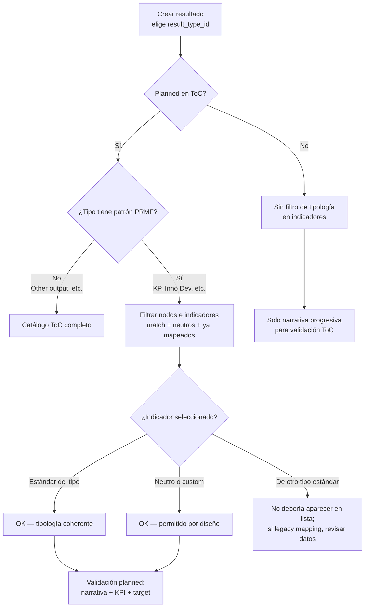

# Reglas de creación de resultados y tipología de indicadores ToC (P25)

Este documento describe cómo PRMS relaciona el **tipo de resultado** (indicator category) con la **tipología del indicador ToC** (`type_value` / `indicator_typology`) en el portafolio **P25**, qué se permite al crear y mapear resultados, y qué ocurre con indicadores no estándar.

> **Guía para usuarios de negocio (sin detalle técnico):** [p25-toc-mapping-guide.md](./p25-toc-mapping-guide.md)

> **Alcance:** Reporting P25 — Contributors & Partners, control list ToC v2, y **Result Framework Reporting** (`/result-framework-reporting`). P22 reutiliza parte de la lógica de alertas en Theory of Change; las reglas de filtrado por tipología del catálogo v2 aplican al mapeo ToC en detalle de resultado, no al dashboard de reporting.

---

## Resumen

| Momento | ¿Hay restricción por tipología ToC? |
|--------|-------------------------------------|
| **Crear resultado** (wizard `/result-creator`) | **No.** El usuario elige libremente entre los tipos activos en `result_by_level`. |
| **Reportar desde Entity Details** (tarjeta por categoría) | **Parcial.** Se **preselecciona** el `result_type_id` de la tarjeta; flujo **unplanned** (sin ToC en el POST). |
| **Reportar desde tabla AoW/HLO** (indicador ToC concreto) | **Sí (UI).** El tipo viene del indicador (`result_type_id` inferido del `type_value`); categoría **solo lectura** si el indicador ya tiene tipo. |
| **Mapear ToC — planned = Yes** (detalle de resultado) | **Sí**, para tipos “estándar” PRMF. Se filtran nodos e indicadores del catálogo ToC v2. |
| **Mapear ToC — planned = No** (unplanned) | **No** se aplica filtro por tipología en indicadores. |
| **Indicadores neutros / custom** | Se permiten en flujos planned; los custom no disparan alerta de mismatch en UI legacy. |

La regla de negocio central en **planned** es:

> Un resultado de tipo X solo ve nodos/indicadores del ToC que **coinciden con X** o que son **neutros** (no coinciden con ningún otro tipo estándar).

---

## 1. Creación de resultados (wizard)

### Qué tipos se pueden crear

Los tipos disponibles vienen de la tabla `result_by_level` + `result_type`, expuestos por:

```
GET /api/results/type-by-level/get/all
```

El frontend (`ResultLevelService`) carga niveles (Impact, Outcome, Output) y, por cada nivel, la lista de `result_type` activos. En creación manual se **ocultan** los tipos 10 (Innovation Package / IPSR) y 11 (Complementary Innovation) del nivel Outcome.

**No existe validación en backend al crear** que exija coherencia con un indicador ToC. La coherencia se exige después, al mapear el resultado al Marco de Resultados (Contributors & Partners en P25).

### Tipos de resultado (enum)

| ID | Nombre | Nivel típico | ¿Filtra ToC en planned? |
|----|--------|--------------|---------------------------|
| 1 | Policy change | Outcome | Sí (`%Number of Policy%`) |
| 2 | Innovation use | Outcome | Sí (`%Innovation Use%`) |
| 3 | Capacity change | Outcome | **No** (sin patrón) |
| 4 | Other outcome | Outcome | **No** (sin patrón) |
| 5 | Capacity sharing for development | Output | Sí (`%Number of people trained%`) |
| 6 | Knowledge product | Output | Sí (`%Number of knowledge products%`) |
| 7 | Innovation development | Output | Sí (`%Number of innovations%`) |
| 8 | Other output | Output | **No** (sin patrón) |
| 9 | Impact contribution | Impact | **No** (sin patrón) |
| 10 | Innovation use (IPSR) | — | Patrón existe pero no se ofrece en wizard |
| 11 | Complementary innovation | — | Oculto en wizard |

Fuente: `onecgiar-pr-server/src/shared/constants/result-type.enum.ts`

---

## 2. Result Framework Reporting (frontend P25)

El módulo `onecgiar-pr-client/src/app/pages/result-framework-reporting/` expone **dos caminos de creación** distintos al wizard clásico. El componente `entity-results-by-indicator-category-card` participa solo en uno de ellos.

### 2.1 `entity-results-by-indicator-category-card` — qué hace y qué no hace

**Ubicación:** `entity-details` → sección *Reporting by Result Category*.

| Aspecto | Comportamiento |
|--------|----------------|
| Datos mostrados | `resultTypeName`, contadores `editing` / `submitted` (vienen de `GET .../programs/indicator-contribution-summary`) |
| Iconos | Por `resultTypeId`: 7=flag, 6=book, 5=users, 2=sun, 1=folder-open |
| Botón **Report** | Visible solo si `EntityAowService.canReportResults()` |
| Al hacer clic | Emite `reportRequested` → el padre abre modal con `app-report-result-form` |

**Reglas en el componente:** ninguna de tipología ToC. Es presentación + permiso de reporte.

### 2.2 Quién puede reportar (`canReportResults`)

Computed en `entity-aow.service.ts`:

```
Admin → siempre true
No admin → reportingEnabled AND el usuario es dueño de la iniciativa (official_code en myInitiativesList)
```

`reportingEnabled` consulta `GET /api/results/admin-panel/phases/:phaseId/reporting-initiatives/:initiativeId/status`. Si falla la API o falta `phaseId`, el código hace **fail-open** (`reportingEnabled = true`).

### 2.3 Agrupación de categorías en Entity Details

`entity-details.component.ts` → `groupedIndicatorSummaries` clasifica las tarjetas con listas **hardcodeadas**:

| Outputs | Outcomes |
|---------|----------|
| Innovation development | Innovation use |
| Knowledge product | Policy change |
| Capacity sharing for development | Other outcome |
| Other output | |

Se **excluye** `Innovation Use(IPSR)` del listado. Los nombres deben coincidir exactamente con `resultTypeName` del backend.

### 2.4 Flujo A — Reporte **unplanned** desde la tarjeta de categoría

```
Clic Report en tarjeta
  → resultLevelSE.setPendingResultType(item.resultTypeId, item.resultTypeName)
  → Modal con app-report-result-form
  → preselectResultType() fija nivel + result_type_id
  → Usuario completa wizard estándar (sin toc_result_id en este paso)
```

- Es el flujo documentado como *"unplanned result"* en el módulo de reporting.
- **No** aplica filtro `RESULT_TYPE_TO_INDICATOR_PATTERN` del catálogo ToC v2.
- El tipo queda **preseleccionado** según la tarjeta; el usuario no partió de un KPI ToC concreto.
- Tras crear, el mapeo ToC ocurre en **Contributors & Partners** del detalle del resultado (ahí sí aplican las reglas de §3–§4).

### 2.5 Flujo B — Reporte **planned** desde tabla AoW / HLO / 2030 Outcomes

```
Clic Report result en fila de indicador (aow-hlo-table)
  → currentResultToReport = nodo ToC + indicador filtrado
  → Modal aow-hlo-create-modal
  → POST /api/results-framework-reporting/create
```

**Inferencia de tipo desde el indicador ToC** (backend, `aow-bilateral.repository.ts`):

| Patrón en `type_value` | `result_type_id` |
|------------------------|------------------|
| `%Number of Policy%` | 1 |
| `%Innovation Use%` | 2 |
| `%Number of people trained (capacity sharing for development)%` | 5 |
| `%Number of knowledge products%` | 6 |
| `%Number of innovations (innovation development)%` | 7 |
| Otro / sin match | `NULL` (sin tipo inferido) |

**Reglas en el modal (`aow-hlo-create-modal`):**

- Si `indicators[0].result_type_id` existe → categoría **solo lectura** (muestra `result_type_name`).
- Si no existe → `p-select` con tipos del nivel (`resultsListFilterSE.filters.resultLevel` según `result_level_id` del nodo).
- KP (`result_type_id === 6` o `type_name === 'Number of knowledge products'`) → exige handle CGSpace/MELSpace/WorldFish + sync MQAP.
- El POST siempre incluye `toc_result_id` + `indicators[0]`; el backend guarda `planned_result: true` (`link-framework-result-toc.service.ts`).

**Validaciones backend en este POST (no tipología cruzada):**

- El indicador debe existir en catálogo ToC.
- El indicador debe pertenecer al `toc_result_id` enviado.
- **No** valida que `result.result_type_id` coincida con el `type_value` del indicador si el usuario eligió tipo manualmente (indicador sin `result_type_id`).

### 2.6 Comparación de los tres puntos de entrada

| Entrada | Planned | Tipo de resultado | ToC en creación | Filtro tipología v2 |
|---------|---------|-------------------|-----------------|---------------------|
| Wizard `/result-creator` | Usuario define después | Libre (`result_by_level`) | No | No |
| Tarjeta categoría (Entity Details) | No (unplanned) | Preseleccionado por tarjeta | No | No |
| Tabla AoW por indicador | Sí (`planned_result: true`) | Del indicador o selector manual | Sí (`toc_result_id` + KPI) | No en POST; sí al editar ToC después |

### 2.7 Archivos frontend clave

| Archivo | Rol |
|---------|-----|
| `entity-results-by-indicator-category-card.component.ts` | Tarjeta + emit `reportRequested` |
| `entity-details.component.ts` | Agrupación outputs/outcomes + modal unplanned |
| `entity-aow.service.ts` | `canReportResults`, `indicatorSummaries`, estado modal |
| `report-result-form.component.ts` | Wizard unplanned; `applyPendingResultTypeSelection()` |
| `aow-hlo-table.component.ts` | Abre modal planned con indicador filtrado |
| `aow-hlo-create-modal.component.ts` | Formulario + `POST_createResult` |

---

## 3. Mapeo tipología ToC ↔ tipo de resultado

### Fuente de verdad (filtrado P25 v2)

```ts
// onecgiar-pr-server/src/shared/constants/indicator-type-mapping.constant.ts
RESULT_TYPE_TO_INDICATOR_PATTERN = {
  INNOVATION_DEVELOPMENT (7):     ['%Number of innovations%'],
  CAPACITY_SHARING (5):           ['%Number of people trained%'],
  KNOWLEDGE_PRODUCT (6):          ['%Number of knowledge products%'],
  POLICY_CHANGE (1):              ['%Number of Policy%'],
  INNOVATION_USE (2):             ['%Innovation Use%'],
  INNOVATION_USE_IPSR (10):       ['%Innovation Use%'],
}
```

El match es **`LIKE`** sobre `toc_results_indicators.type_value` en el esquema externo `${DB_TOC}`.

Ejemplos de `type_value` que hacen match:

| Tipo resultado | Ejemplo `type_value` en ToC |
|----------------|----------------------------|
| Knowledge product (6) | `Number of knowledge products` |
| Innovation development (7) | `Number of innovations` o `Number of innovations (innovation development)` |
| Capacity sharing (5) | `Number of people trained (capacity sharing for development)` |
| Policy change (1) | Cualquier texto que contenga `Number of Policy` |
| Innovation use (2) | Cualquier texto que contenga `Innovation Use` |

En la API v2, ese valor se expone también como **`indicator_typology`** (alias de `type_value`) en cada indicador del control list.

Endpoint:

```
GET /v2/toc/result/:resultId/initiative/:initiativeId/level/:levelId?planned=true|false
```

### Mapeo legacy (P22 / reporting de targets)

En `results-toc-results.repository.ts` existe un mapeo **por igualdad exacta** de strings legacy del PRMF Framework a `number_result_type`. Se usa para alertas de progreso en Theory of Change (P22), no para el filtrado v2:

| `type_value` (exacto) | `number_result_type` |
|-----------------------|----------------------|
| `Number of innovations` | 7 |
| `Number of peer reviewed journal papers` | 6 |
| `Number of other information products/data assets (...)` | 6 |
| `Number of people trained, long-term (...)` | 5 |
| `Number of policies/ strategies/ laws/ ...` | 1 |
| `Number of beneficiaries using the CGIAR innovation...` | 2 |
| `Other quantitative measure of CGIAR innovation use (e.g. area)` | 2 |
| `Change in the capacity of key (a) Individuals...` | 3 |
| `Altmetric score` | 4 |
| Cualquier otro valor | 0 (`N/A`) |

### Mapeo bilateral / AoW (consultas de revisión)

`aow-bilateral.repository.ts` usa patrones **más específicos** (texto completo del tipo 2026), por ejemplo `%Number of innovations (innovation development)%`, para inferir `result_type_id` al listar indicadores en flujos bilaterales.

---

## 4. Reglas de filtrado del catálogo ToC (planned)

Implementación: `TocResultsRepository.$_getResultTocByConfigV2` y `getTocIndicatorsByResultIds`.

### Cuándo aplica el filtro

| Condición | Filtro por tipología |
|-----------|----------------------|
| `planned=true` (query param) **y** `result_type_id` tiene patrón en `RESULT_TYPE_TO_INDICATOR_PATTERN` | **Sí** |
| `planned=false` (resultado no planificado) | **No** en indicadores |
| Tipo sin patrón (Other output, Other outcome, Capacity change, Impact contribution) | **No** — se muestran todos los nodos/indicadores activos |
| Resultado ya mapeado a un nodo ToC | Ese nodo **siempre** se incluye aunque no pase el filtro |

### Regla para nodos ToC (`$_getResultTocByConfigV2`)

Un nodo es visible si cumple **cualquiera** de:

1. **Tiene al menos un indicador activo** cuyo `type_value` hace `LIKE` el patrón del tipo del resultado.
2. **No tiene ningún indicador activo** que haga match con los patrones de **otros** tipos estándar → nodo **neutro**.
3. **Ya está mapeado** al resultado (`results_toc_result` activo).

```
                    ┌─────────────────────────────┐
                    │  Resultado planned, tipo T  │
                    └──────────────┬──────────────┘
                                   │
           ┌───────────────────────┼───────────────────────┐
           ▼                       ▼                       ▼
   Indicador match T      Sin indicadores de         Ya mapeado
   en el nodo             otros tipos estándar         al resultado
           │                       │                       │
           └───────────────────────┴───────────────────────┘
                                   │
                                   ▼
                          Nodo visible en lista
```

### Regla para indicadores (`getTocIndicatorsByResultIds`)

En planned, cada indicador del nodo es visible si:

1. **`type_value` coincide** con el patrón del tipo del resultado, **o**
2. Es **neutro**: `type_value` no coincide con ningún patrón de *otros* tipos, **o** es `NULL` / vacío, **o**
3. **Ya está guardado** en `results_toc_result_indicators` (siempre visible aunque esté inactivo en catálogo si aplica la regla de visibilidad por link).

En **unplanned** (`planned_result = 0` en el primer `results_toc_result` del resultado): **no se aplica** filtro por tipología en indicadores.

### Años de reporting

- Los targets de indicador se resuelven contra el **año de fase del resultado** (`version.phase_year`), no el año activo de la plataforma.
- Si el año del resultado es **anterior** al año activo, se incluyen indicadores inactivos del catálogo (`includeInactiveIndicators = true`) para no romper mapeos históricos.

---

## 5. Indicadores no estándar, neutros y custom

### Indicadores neutros

Un indicador es **neutro** cuando su `type_value`:

- No hace `LIKE` con ningún patrón de `RESULT_TYPE_TO_INDICATOR_PATTERN`, y
- No es vacío/null en el sentido del filtro SQL.

**Comportamiento:** en un resultado **planned** de tipo estándar (p. ej. KP), los indicadores neutros **sí aparecen** en el dropdown y **se pueden seleccionar**. Esto permite reportar contra KPIs del ToC que no siguen la taxonomía PRMF estricta.

### Indicadores custom

- En contribution-to-indicators, `is_indicator_custom = true` cuando `trim(type_value) LIKE 'custom'`.
- En UI legacy (`target-indicator.component`), si `type_value === 'custom'`, **no** se muestra la alerta de mismatch de tipología aunque `number_result_type` no coincida.

### Indicadores de otro tipo estándar

Si un nodo ToC solo tiene indicadores de otro tipo PRMF (p. ej. solo “Number of innovations” en un resultado KP planned), el **nodo no aparece** en el control list (salvo que ya estuviera mapeado).

### Tipos “Other output” (8) y “Other outcome” (4)

- **No tienen patrón** → ven **todo** el catálogo ToC e **todos** los indicadores (planned).
- En alertas legacy de mismatch, están **exentos**: aunque `number_result_type !== result_type_id`, no se bloquea el reporte de progreso por tipología.

---

## 6. Validaciones P25 al completar secciones

Las validaciones de submit / green checks usan funciones MySQL por portafolio (`validation_*_P25`), invocadas vía `validate_sections_mapped_batch` y `validation_maps`.

### `validation_toc_P25`

Para resultados con `result_level_id` **distinto de 1 y 2** (típicamente Output/Outcome):

- Cada fila activa de `results_toc_result` debe tener `planned_result` definido.
- Si hay `toc_result_id`, debe existir `planned_result`.
- La iniciativa líder debe tener exactamente un mapeo ToC con nodo seleccionado.
- Cada iniciativa contribuyente (rol 2) debe tener su propio mapeo ToC.

Para `result_level_id = 1` (Impact): validaciones adicionales de impact area targets/indicators.

> Esta función **no** valida coherencia tipología ↔ `result_type_id`; valida **completitud estructural** del mapeo.

### `validation_contributor_partner_P25`

Sección Contributors & Partners (incluye ToC en P25):

| Escenario | Requisitos ToC |
|-----------|----------------|
| **Unplanned** (`planned_result = FALSE`) | Solo `toc_progressive_narrative` válido |
| **Planned** (`planned_result = TRUE`) | Por cada combinación nodo/indicador: narrativa + `toc_result_id` + indicador seleccionado + `number_target > 0` |

Además valida partners, centros, lead center/partner, etc.

---

## 7. Comportamiento en frontend (detalle de resultado)

### P25 Contributors & Partners (2026)

- Campo read-only **Indicator Tipology** = `indicator_typology` del KPI seleccionado (solo fase 2026 / `isCP2026()`).
- El dropdown de KPI usa la misma lista filtrada que devuelve el backend v2.

### P22 Theory of Change — alerta de mismatch

`target-indicator.component.ts`:

```ts
// Muestra alerta si el tipo del indicador (number_result_type) ≠ tipo del resultado,
// excepto: custom, Other outcome (4), Other output (8)
checkAlert() {
  if (type_value !== 'custom'
      && number_result_type !== result.result_type_id
      && result_type_id != 4 && result_type_id != 8) return true;
  return false;
}
```

Mensaje: *"The type of result you are reporting does not match the type of this indicator, therefore, progress cannot be reported."*

---

## 8. Flujo recomendado para equipos de producto



---

## 9. Preguntas frecuentes

### ¿Si el indicador es KP solo puedo crear KPs?

**Al crear:** puedes crear cualquier tipo permitido en el wizard.  
**Al mapear ToC (planned):** solo verás nodos/indicadores compatibles con KP **más** los neutros/custom. No verás indicadores claramente de Innovation Development, Policy, etc.

### ¿Qué pasa si el ToC tiene un indicador con `type_value` vacío?

Se trata como **neutro** y está disponible para cualquier tipo estándar en planned.

### ¿Puedo mapear un resultado Innovation Development a un KPI sin tipología estándar?

Sí, si el indicador es **neutro** (no matchea otros tipos PRMF) o **custom**.

### ¿Other output puede mapearse a cualquier indicador?

Sí. No hay filtro por tipología en planned para tipos 4 y 8.

### ¿La tarjeta `entity-results-by-indicator-category-card` filtra por tipología ToC?

**No.** Solo muestra resumen por categoría y abre el flujo **unplanned** con el `result_type_id` de la tarjeta preseleccionado. Las reglas de tipología ToC aplican después, al mapear en Contributors & Partners, o en el flujo **planned** desde la tabla AoW (§2.5).

### ¿Dónde cambiar las reglas?

| Cambio | Archivo |
|--------|---------|
| Patrones de filtrado P25 | `src/shared/constants/indicator-type-mapping.constant.ts` |
| SQL filtrado nodos/indicadores | `src/toc/toc-results/toc-results.repository.ts` |
| Mapeo legacy exacto (alertas P22) | `src/api/results/results-toc-results/repositories/results-toc-results.repository.ts` |
| Tipos en wizard | Tabla `result_by_level` + `ResultLevelService.removeResultTypes()` |
| Validación submit P25 | Migraciones / funciones `validation_*_P25` |

---

## 10. Referencias de código

| Artefacto | Ubicación |
|-----------|-----------|
| Patrones tipología ↔ tipo | `src/shared/constants/indicator-type-mapping.constant.ts` |
| Filtrado catálogo ToC v2 | `src/toc/toc-results/toc-results.repository.ts` |
| Enriquecimiento API (`indicator_typology`) | `src/toc/toc-results/toc-results.service.ts` → `findTocResultByConfigV2` |
| Control list HTTP | `src/toc/toc-results/toc-results.controller.ts` (v2) |
| Tipos por nivel (creación) | `src/api/results/result-by-level/` |
| Validación ToC P25 | `src/migrations/1762528725798-createValidtionP25.ts` → `validation_toc_P25` |
| Validación Contributors P25 | `src/migrations/1762866499786-updatepartnersContributors.ts` → `validation_contributor_partner_P25` |
| Inferencia tipo en reporting framework | `src/api/results-framework-reporting/.../aow-bilateral.repository.ts` |
| Tarjeta categoría (unplanned) | `onecgiar-pr-client/.../entity-results-by-indicator-category-card/` |
| Modal planned AoW | `onecgiar-pr-client/.../aow-hlo-create-modal/` |
| Creación framework (`planned_result: true`) | `src/api/results-framework-reporting/.../link-framework-result-toc.service.ts` |
| Skill agente ToC | `.cursor/skills/toc/SKILL.md` |

---

## Historial de cambios

| Fecha | Descripción |
|-------|-------------|
| 2026-06-25 | Documento inicial: reglas de tipología ToC, planned/unplanned, indicadores neutros/custom y validaciones P25. |
| 2026-06-25 | §2 Result Framework Reporting: tarjeta por categoría, flujos planned/unplanned, `canReportResults`, inferencia en AoW. |
